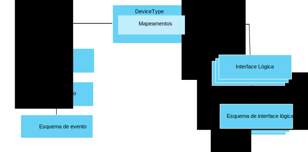

---

copyright:
years: 2016, 2017
lastupdated: "2017-07-21"

---

{:new_window: target="\_blank"}
{:shortdesc: .shortdesc}
{:screen: .screen}
{:codeblock: .codeblock}
{:pre: .pre}

# Introdução ao gerenciamento de dados
{: #im_example}

Use as etapas a seguir para ajudar a configurar os recursos necessários para começar a usar o recurso de gerenciamento de dados.

Para obter detalhes sobre a API, consulte a documentação da [API de REST HTTP do {{site.data.keyword.iot_full}}](https://docs.internetofthings.ibmcloud.com/apis/swagger/v0002/state-mgmt.html){:new_window}.

**Dica:** Para obter informações mais detalhadas sobre cada uma das etapas, consulte os cenários de exemplo ou use os links para ir diretamente para uma etapa específica no guia passo a passo. O [Guia passo a passo: um exemplo detalhado sobre como trabalhar com dispositivos por meio de uma interface comum](ga_im_index_scenario.html#scenario) guia você pelas etapas de criação de uma interface lógica de tipo
de dispositivo para dispositivos de termômetro heterogêneos.

## Antes de iniciar
Para começar a usar o recurso de gerenciamento de dados, deve-se ter pelo menos um [dispositivo registrado](ga_im_index_scenario.html#step14) e enviar dados para o {{site.data.keyword.iot_short_notm}}.  

O diagrama a seguir mostra uma visualização lógica de como os recursos que você precisa configurar se ajustam:

## Etapas

1. 	Defina as propriedades de estado de entrada.  
Defina as propriedades de estado recebidas que você deseja que sua interface lógica disponibilize aos seus aplicativos.  
<dl>
<dd>
<ol>
<li>[Crie um arquivo de esquema de evento de rascunho](ga_im_index_scenario.html#step1). O arquivo de esquema de evento é um arquivo .JSON local que define a estrutura e o formato de um evento de entrada.
<li>[Crie um recurso de esquema de evento de rascunho para seu tipo de evento](ga_im_index_scenario.html#step2). O recurso de esquema de evento é uma construção programática que é usada pelo {{site.data.keyword.iot_short_notm}}.
<li>[Crie um tipo de evento de rascunho que referencie o esquema de evento](ga_im_index_scenario.html#step3). O tipo de evento é utilizado pelo {{site.data.keyword.iot_short_notm}} para mapear um ou mais recursos de esquema de evento para uma interface física.
<li>[Crie uma interface física de rascunho](ga_im_index_scenario.html#step7).
<li>[Inclua o tipo de evento na interface física de rascunho](ga_im_index_scenario.html#step8).
<li>[Atualize o tipo de dispositivo de rascunho para conectar a interface física de rascunho](ga_im_index_scenario.html#step9).
</ol>
</dd>
</dl>
4. 	Crie a interface lógica de rascunho.
 1. 	[Crie um arquivo de esquema de interface lógica de rascunho](ga_im_index_scenario.html#step4) para o tipo de dispositivo de rascunho.  
Um arquivo de esquema de interface lógica é um arquivo .JSON local que define o estado do dispositivo que é disponibilizado para seus aplicativos.
 2. [Crie um recurso de esquema de interface lógica de rascunho](ga_im_index_scenario.html#step5) para o tipo de dispositivo de rascunho.
 3.	[Crie uma interface lógica de rascunho](ga_im_index_scenario.html#step6) para o tipo de dispositivo de rascunho.
 4.	[Inclua a interface lógica de rascunho no tipo de dispositivo de rascunho](ga_im_index_scenario.html#step10).
5. 	[Defina os mapeamentos de rascunho](ga_im_index_scenario.html#step11) para o tipo de dispositivo de rascunho.   
Os mapeamentos são usados para mapear propriedades de entrada para propriedades na interface lógica.
6. 	[Valide e ative a configuração](ga_im_index_scenario.html#step15) que está associado ao tipo de dispositivo de rascunho.
7. 	[Recupere o estado do dispositivo ativo](ga_im_index_scenario.html#step13).  
Verifique se suas assinaturas mostram os dados do dispositivo atualizados ou se esses dados são retornados usando uma chamada REST ou assinando um tópico.
