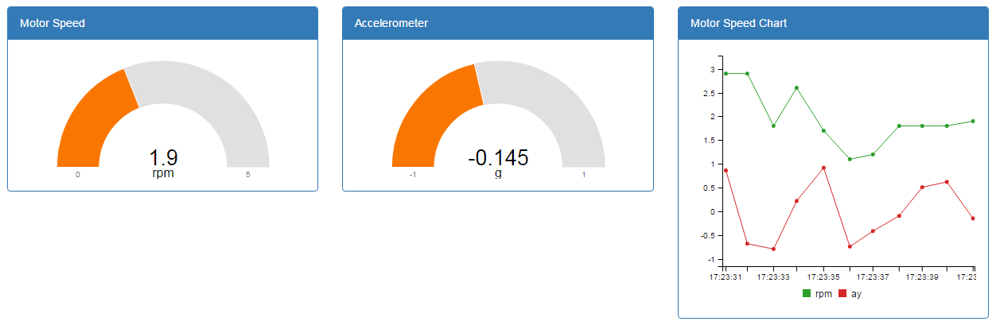

---

copyright:
  years: 2017
lastupdated: "2017-06-16"

---

{:shortdesc: .shortdesc}
{:new_window: target="_blank"}
{:codeblock: .codeblock}
{:pre: .pre}
{:screen: .screen}
{:tip: .tip}

# Guia 3: Monitorando seus dados do dispositivo
Agora que você tem um ou mais dispositivos conectados, é hora de começar a monitorar dados do dispositivo em tempo real.
{:shortdesc}

## Visão geral e objetivo
{: #overview}  

Neste guia, você implementará um aplicativo de monitoramento no {{site.data.keyword.Bluemix_notm}} para visualizar dados de seus dispositivos.

Como no guia 1, é possível seguir um ou ambos os seguintes caminhos:
- Caminho A: [Etapa 1A - Implementar e conectar o aplicativo da web de monitoramento](#deploy_app)  
Seguindo o caminho A, você implementará um aplicativo pronto que monitora os dispositivos de esteira transportadora que você está executando em sua organização.
- Caminho B: [Etapa 1B - Criar uma interface com o usuário de monitoramento usando a biblioteca de widgets](#widget-library)
O caminho B um pouco mais complexo apresenta a biblioteca de widgets e orienta você na criação da interface com o usuário básica.

## Pré-requisito
{: #prereqs}  
Antes de iniciar, certifique-se de que os requisitos a seguir sejam atendidos.

### Ambiente local
- [Node.js ](https://nodejs.org){: new_window} versão 6.x ou superior.
- Caminho A: [CLI Angular ](https://github.com/angular/angular-cli){: new_window} versão 1.x ou superior.  
- [Cloud Foundry CLI ](https://github.com/cloudfoundry/cli#downloads){: new_window}  
Use o cf CLI para implementar apps e serviços no {{site.data.keyword.Bluemix_notm}}. Para obter mais informações, veja a [documentação do Cloud Foundry CLI](https://docs.cloudfoundry.org/cf-cli/){: new_window}  
- Opcional: [Git ](https://git-scm.com/downloads){: new_window}  
Se você escolhe usar o Git para fazer download das amostras de código, deve-se ter também uma [conta GitHub.com ](https://github.com){: new_window}. Também é possível fazer download do código como um arquivo compactado sem uma conta GitHub.com.

### Outros requisitos
Você também deve ter um dispositivo conectado do tipo `iot-conveyor-belt` que envia eventos com o nome `sensorData` e com uma carga útil de mensagem que inclui as propriedades a seguir:
```
{
	"d": {
		"id": "belt1", 		"ts": 1494946276931, 		"ay": "0.00", 		"running": true, 		"rpm": "1.0"
		}
}
```
Para obter mais informações sobre eventos de dispositivo e formato do sistema de mensagens, veja [Publicando eventos](/docs/services/IoT/devices/mqtt.html#publishing_events).  
Se você concluiu o [Guia 1: introdução à {{site.data.keyword.iot_short_notm}} e uma esteira transportadora simulada](getting-started-iot-conveyor.html), tudo está pronto.  
{: tip}

## Etapa 1A - Implementar e conectar o aplicativo da web de monitoramento
{: #deploy_app}

O aplicativo de amostra Plant Floor Monitoring lista todos os tipos de dispositivo iot-conveyor-belt que estão conectados à sua organização do {{site.data.keyword.iot_short_notm}} com um subconjunto dos dados do evento, como RPM, última atualização e o ID do dispositivo.

O aplicativo de amostra é construído usando as bibliotecas do cliente Node.js em: [https://github.com/ibm-watson-iot/iot-nodejs ](https://github.com/ibm-watson-iot/iot-nodejs){: new_window}


Como parte desta etapa, você:
- Implemente um aplicativo da web de monitoramento de amostra originado no GitHub usando o Cloud Foundry.
- Configure o aplicativo de amostra para se conectar com {{site.data.keyword.iot_short_notm}} usando uma chave API e um token de autenticação.
- Use o aplicativo da web para monitorar seus dispositivos de esteira transportadora conectados.  

### Etapas detalhadas
As etapas a seguir conduzem você pela criação e implementação do app no {{site.data.keyword.Bluemix_notm}}. Para obter informações sobre como executar o app localmente, veja o arquivo LEIA-ME no GitHub.
1. Clone o repositório GitHub do aplicativo de amostra *Plant Floor
Monitoring* do Node.js.  
Use sua ferramenta git favorita para clonar o repositório a seguir:  
https://github.com/ibm-watson-iot/guide-conveyor-ui-angular
No shell do Git, use o comando a seguir:
  ```bash
git clone https://github.com/ibm-watson-iot/guide-conveyor-ui-angular
  ```
2. Crie uma combinação de chave API e token de autenticação para seu aplicativo.  
Você precisará deles quando configurar o aplicativo para se conectar à sua organização. Para
obter mais informações sobre como registrar dispositivos, consulte [Conectando aplicativos](/docs/services/IoT/platform_authorization.html).  
 1. Abra o painel {{site.data.keyword.iot_short_notm}}.
 2. Selecione **Aplicativos**.
 3. Clique em **Gerar Chave API**
 4. Copie os valores de chave API e token de autenticação que são listados.
 5. Selecione **Aplicativo de visualização** como a função de API.  
**Dica:** se você incluir mais recursos no aplicativo, precisará elevá-lo a uma função superior.
 6. Inclua um comentário para que possa identificar facilmente essa combinação de chave API e token de autenticação.
 7. Clique em **Gerar**.
3. Configure seu aplicativo para se conectar ao {{site.data.keyword.Bluemix_notm}}.
Navegue para a raiz do repositório *guide-conveyor-ui-angular* e crie um
arquivo `basicConfig.json` que contenha o conteúdo a seguir:
  ```
{
  "org": "your orgID",
  "apiKey": "your API key",
  "apiToken": "your Authentication Token"
}
  ```
Substitua os valores de parâmetro pelos valores correspondentes da sua organização do {{site.data.keyword.Bluemix_notm}}: orgID, chave API e token de autenticação que você acabou de criar.  
Exemplo:
```
 {   
  "org": "3v5whr",    
  "apiKey": "a-3v5whr-jhkmsghlqv",  
  "apiToken": "-q0MkPN2cNYB6+?ISk"  
}
```
4. Efetue login em sua conta do {{site.data.keyword.Bluemix_notm}} usando a CLI cloudfoundry.  
Para obter mais informações, veja a [documentação do Cloud Foundry CLI](https://docs.cloudfoundry.org/cf-cli/){: new_window}  
Na linha de comandos, insira o comando a seguir:  
  ```
cf login
  ```
Se solicitado, selecione a organização e o espaço em que você deseja implementar o aplicativo de amostra de monitoramento.
5. Se necessário, configure seu terminal de API executando o comando cf api.   
Substitua o valor `API-ENDPOINT` pelo terminal de API para sua região.
  ```
cf api API-ENDPOINT
  ```
Exemplo: `cf api https://api.ng.bluemix.net`
<table>
<tr>
<th>Região</th>
<th>Terminal de API</th>
</tr>
<tr>
<td>Sul dos Estados Unidos</td>
<td>https://api.ng.bluemix.net</td>
</tr>
<tr>
<td>Reino Unido</td>
<td>https://api.eu-gb.bluemix.net</td>
</tr>
<!--<tr>
<td>Germany</td>
<td>https://api.eu-de.bluemix.net</td>
</tr>-->
</table>
6. Mude o diretório para o diretório no qual o aplicativo de amostra está localizado.  
  ```
cd guide-conveyor-ui-angular
  ```
7. Execute `npm install -g @angular/cli` para instalar a CLI Angular.
8. Execute `npm install`.
9. Execute `npm run push` para construir o projeto e enviar por push para sua organização.  
Seu aplicativo da web de amostra é implementado no {{site.data.keyword.Bluemix_notm}}.  
Quando a implementação é concluída, uma mensagem é exibida para indicar que seu app está em execução.   
Exemplo:  
  ```
requested state: started
instances: 1/1
usage: 64M x 1 instances
urls: iotmonitoringcontrol-undertided-eng.mybluemix.net
last uploaded: Tue May 16 19:01:13 UTC 2017
stack: cflinuxfs2
buildpack: https://github.com/cloudfoundry/nodejs-buildpack
     state     since                    cpu    memory     disk        details
#0   running   2017-05-16 03:03:05 PM   0.0%   0 of 64M   0 of 256M
  ```
10. Abra o aplicativo da web.  
No painel de apps do {{site.data.keyword.Bluemix_notm}}, clique em **Visitar URL do app** para abrir o aplicativo da web.  
Acesse e gerencie a URL do aplicativo clicando em **Rotas**.   
A URL padrão é semelhante a:  
`https://iotmonitoringcontrol-RANDOM-STRING-ENG.mybluemix.net`

## Etapa 1B - Criar uma interface com o usuário de monitoramento usando a biblioteca de widget
{: #widget-library}

O aplicativo de amostra baseado na biblioteca de widget inclui um medidor de
velocidade de motor, um medidor de dados do acelerômetro e um diagrama de velocidade de
motor que exibe os dados para um único dispositivo do tipo iot-conveyor-belt que é
conectado à sua organização do {{site.data.keyword.iot_short_notm}}. É possível
usar o código de amostra para construir um aplicativo front-end completo para seus
dispositivos conectados ao {{site.data.keyword.iot_short_notm}}.



Como parte desta etapa, você:
- Implemente um aplicativo da web de amostra originado no GitHub usando o Cloud Foundry.
- Configure o aplicativo de amostra para se conectar com {{site.data.keyword.iot_short_notm}} usando uma chave API e um token de autenticação.
- Configure três widgets da interface com o usuário para exibir dados do dispositivo como medidores e gráficos.
- Use o aplicativo da web para monitorar seu dispositivo de esteira transportadora conectado.  

### Etapas detalhadas
As etapas a seguir conduzem você pela criação e implementação do app no {{site.data.keyword.Bluemix_notm}}. Para obter informações sobre como executar o app localmente, veja o arquivo LEIA-ME no GitHub.
1. Clone o repositório GitHub do aplicativo de amostra *Widget Library Monitoring*.  
Use sua ferramenta git favorita para clonar o repositório a seguir:  
https://github.com/ibm-watson-iot/guide-conveyor-ui-html
Em Shell do Git, use o comando a seguir:
```
git clone https://github.com/ibm-watson-iot/guide-conveyor-ui-html
```
2. Instale as dependências do aplicativo.  
Navegue para a raiz do repositório *guide-conveyor-ui-html* e execute o comando a seguir:
```
npm install
```
3. Construa a interface com o usuário.  
Para construir a interface com o usuário do aplicativo, deve-se incluir os widgets como
código JavaScript no arquivo index.html do aplicativo para cada componente da interface
com o usuário.  
Cada widget usa os seguintes parâmetros JavaScript:  
`WIoTPWidget.CreateWIDGET_TYPE("ELEMENT_ID","EVENT_NAME", "DEVICE_TYPE", "DEVICE_ID", "PROPERTY" , {WIDGET_DEFAULT_OVERRIDE}, [WIDGET_SPECIFIC_SETTINGS])`

A tabela a seguir fornece as descrições dos parâmetros:

| Parâmetro | Descrição |    
| ----- | ---- |   
| WIDGET_TYPE | O tipo de widget a ser criado. Exemplo: `Gauge` ou `Chart` |
| ELEMENT_ID | O ID do elemento do widget, como ele aparecerá no aplicativo. Exemplo: `RPM` |
| EVENT_NAME | O nome do evento do dispositivo que inclui a propriedade a ser exibida. Exemplo: `sensorData` |
| DEVICE_TYPE | O tipo de dispositivo. Exemplo: `iot-conveyor-belt` |
| DEVICE_ID | O ID do dispositivo que fornece os dados a serem exibidos. Exemplo: `belt1` |
| PROPERTY | A propriedade de carga útil da mensagem do dispositivo a ser exibida. Exemplo: `rpm` |
| WIDGET_DEFAULT_OVERRIDE | As definições de configuração de widget para substituir as configurações padrão.|
| WIDGET_SPECIFIC_SETTINGS | Um ou mais parâmetros adicionais para o widget; veja os exemplos. |

Para obter detalhes sobre cada tipo de widget, veja os exemplos a seguir e a
documentação no [Repositório
GitHub de widgets do IoT](https://github.com/ibm-watson-iot/iot-widgets){: new_page}.
 1. Inclua um medidor RPM.  
Esse medidor exibe o rpm da esteira transportadora como um medidor que tenha no mínimo 0 e no máximo 5 rpm.
    1. Abra o modelo a seguir para edição: `public/index.html`  
    2. Localize o sinalizador de medidor rpm: `<!--- place holder for rpm gauge  -->`
    3. Inclua o elemento div a seguir com um ID exclusivo conforme mostrado:
 ```html
 <div id="rpmgauge" ></div>
 ```  
    3. Localize o item temporário JavaScript: `/// Add your scripts here`
    4. Inclua o código JavaScript rpm.  
Exemplo:  
 ```javascript
 WIoTPWidget.CreateGauge("rpmgauge","sensorData", "iot-conveyor-belt", "belt1", "rpm" ,{
            label: {
                format: function(value, ratio) {
                    valor de retorno; }, mostrar: true // para desativar os rótulos de mín./máx.
            },
         min: 0.0, // 0 is default, can handle negative min e.g. vacuum / voltage / current flow / rate of change
         max: 5.0, // 100 is default
         units: 'rpm'
       },['#FF0000', '#F97600', '#F6C600', '#60B044']);
 ```
 2. Inclua um medidor de aceleração.  
Esse monitor exibe a leitura do acelerômetro como um monitor que tenha leituras entre -1 e 1.
    1. Localize o sinalizador de medidor do acelerômetro: `<!--- place holder for accelerometer gauge  -->`
    2. Inclua o elemento div a seguir com um ID exclusivo, conforme mostrado:
 ```html
 <div id="aygauge" ></div>
 ```  
    3. Localize o sinalizador de javascript: `// / Incluir seus scripts aqui`
    4. Inclua o código JavaScript do acelerômetro.  
Exemplo:   
 ```javascript
 WIoTPWidget.CreateGauge("aygauge","sensorData", "iot-conveyor-belt", "belt1", "ay" ,{
      label: {
          format: function(value, ratio) {
              valor de retorno; }, mostrar: true // para desativar os rótulos de mín./máx.
      },
   min: -1.0, // 0 is default,can handle negative min e.g. vacuum / voltage / current flow / rate of change
   max: 1.0, // 100 is default
   units: 'g'//,
 },['#FF0000', '#F97600', '#F6C600', '#60B044']);
 ```
 3. Inclua um gráfico de velocidade do motor.  
Esse gráfico exibe a velocidade do motor como um diagrama de linha.
    1. Localize o sinalizador do medidor de velocidade do motor: `<!--- place holder for motor speed gauge  -->`
    2. Inclua o elemento div a seguir com um ID exclusivo, conforme mostrado:
 ```html
 <div id="speedchart" ></div>
 ```  
    3. Localize o item temporário JavaScript: `/// Add your scripts here`
    4. Inclua o código JavaScript do gráfico de velocidade.  
Exemplo:  
 ```javascript
 WIoTPWidget.CreateChart("speedchart ","sensorData", "iot-conveyor-belt", "belt1",
 ["rpm", "ay"], [["line","rpm"],["line","ay"]],['#2ca02c','#d62728']);
 ```
4. Implemente o aplicativo no {{site.data.keyword.Bluemix_notm}}  
 1. Atualize o arquivo manifest.yml com seu nome do serviço do {{site.data.keyword.iot_short_notm}}.  
Por exemplo, se você implementou um serviço do {{site.data.keyword.iot_short_notm}} como parte do [Guia 1: Conectando um dispositivo de esteira transportadora](getting-started-iot-monitoring.html), YOUR_PLATFORM_NAME é `iotp-for-conveyor`.
<pre><code>
declared-services:
  YOUR_IOT_PLATFORM_NAME:  </br>
    label: iotf-service  </br>
    plano: iotf-service-free  </br>
applications:  </br>
\- path: .  </br>
  memory: 128M  </br>
  instâncias: 1  </br>
  domain: mybluemix.net  </br>
  disk_quota: 1024M  </br>
  services:  </br>
  \- YOUR_IOT_PLATFORM_NAME  </br>
</pre></code>
 2. Efetue login em sua conta do {{site.data.keyword.Bluemix_notm}} usando a CLI cloudfoundry.  
 Para obter mais informações, veja a [documentação do Cloud Foundry CLI](https://docs.cloudfoundry.org/cf-cli/){: new_window}  
 Na linha de comandos, insira o comando a seguir:  
   ```
 cf login
   ```
 Se solicitado, selecione a organização e o espaço em que você deseja implementar o aplicativo de amostra de monitoramento.
 5. Se necessário, configure seu terminal de API executando o comando cf api.   
 Substitua o valor `API-ENDPOINT` pelo terminal de API para sua região.
   ```
 cf api API-ENDPOINT
   ```
 Exemplo: `cf api https://api.ng.bluemix.net`
 <table>
 <tr>
 <th>Região</th>
 <th>Terminal de API</th>
 </tr>
 <tr>
 <td>Sul dos Estados Unidos</td>
 <td>https://api.ng.bluemix.net</td>
 </tr>
 <tr>
 <td>Reino Unido</td>
 <td>https://api.eu-gb.bluemix.net</td>
 </tr>
 <!--<tr>
 <td>Germany</td>
 <td>https://api.eu-de.bluemix.net</td>
 </tr>-->
 </table>
 6. Mude o diretório para o diretório no qual o aplicativo de amostra está localizado.  
   ```
 cd guide-conveyor-ui-html
   ```
 2. Execute o comando cf push para enviar por push o aplicativo para o {{site.data.keyword.Bluemix_notm}}:  
Dê a seu aplicativo um nome exclusivo.
```
cf push YOUR_APP_NAME
```
5. Abra o aplicativo da web baseado em biblioteca de widgets.  
No painel de apps do {{site.data.keyword.Bluemix_notm}}, clique em **Visitar URL do app** para abrir o aplicativo da web.  
Acesse e gerencie a URL do aplicativo clicando em **Rotas**.   
A URL padrão é semelhante a:  
`https://YOUR_APP_NAME.mybluemix.net`

## Etapa 2 - Visualizar seus dispositivos conectados
{: #view_devices}

Agora que o console da web está funcionamento, é possível visualizar seus dispositivos de esteira transportadora conectados.
1. Na seção **Dispositivos** do console da web, verifique se suas esteiras transportadoras são listadas e se é exibido o estado correto de Execução e RPM.
2. Mude o valor RPM para o seu dispositivo de esteira transportadora e verifique se o valor é atualizado conforme esperado no aplicativo de monitoramento.


## O que Vem a Seguir?
{: @whats_next}  
Continue com o próximo guia ou vá para outro tópico de seu interesse:
- Caminho A: Modifique o aplicativo de monitoramento conforme suas necessidades.  
Para obter detalhes técnicos, veja:
 - [https://github.com/ibm-watson-iot/guide-conveyor-ui-angular/blob/master/README.md ](https://github.com/ibm-watson-iot/guide-conveyor-ui-angular/blob/master/README.md){: new_window}
 - [Bibliotecas do cliente Node.js ](https://github.com/ibm-watson-iot/iot-nodejs){: new_window}
- Caminho B: Modifique o aplicativo de biblioteca de widget conforme suas necessidades.  
Para obter detalhes técnicos, veja:
 - [https://github.com/ibm-watson-iot/guide-conveyor-ui-html/blob/master/README.md ](https://github.com/ibm-watson-iot/guide-conveyor-ui-html/blob/master/README.md){: new_window}
- [Guia 4: simulando um grande número de dispositivos](getting-started-iot-large-scale-simulation.html)  
Expanda a simulação básica, incluindo grandes números de simuladores de auto-execução em seu ambiente. Essa expansão permitirá testar a análise básica e o monitoramento dos guias anteriores em um ambiente mais realista, com vários dispositivos.
- [Saiba mais sobre a {{site.data.keyword.iot_short_notm}}](/docs/services/IoT/iotplatform_overview.html){:new_window}
- [Saiba mais sobre APIs de {{site.data.keyword.iot_short_notm}}](/docs/services/IoT/reference/api.html){:new_window}
