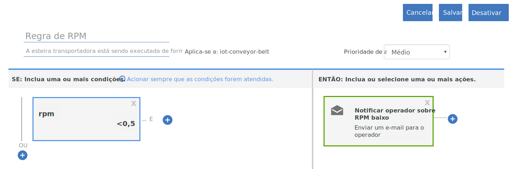

---

copyright:
  years: 2017
lastupdated: "2017-06-16"

---

{:shortdesc: .shortdesc}
{:new_window: target="_blank"}
{:codeblock: .codeblock}
{:pre: .pre}
{:screen: .screen}
{:tip: .tip}

# Guia 2: Usando regras e ações básicas em tempo real
Use as instruções neste guia para configurar um conjunto de regras e ações básicas
para algumas análises em tempo real de seus dados do IoT da esteira transportadora.
{:shortdesc}

## Visão geral e objetivo
{: #overview}  
Agora que você configurou com êxito sua esteira transportadora, a conectou com {{site.data.keyword.iot_short_notm}} e enviou alguns dados, é hora de fazer esses dados trabalharem por você usando regras e ações.



Como parte deste guia, você:
- Criará um esquema de mensagem para os dados de evento de dispositivo de esteira transportadora.
- Criará e acionará uma regra.
- Criará uma ação de e-mail.

## Pré-requisito
{: #prereqs}  
Deve-se ter um dispositivo conectado do tipo `iot-conveyor-belt` que envia eventos com o nome
`sensorData` e com uma carga útil de mensagem que inclui as propriedades
a seguir:
```
{
	"d": {
		"id": "belt1", 		"ts": 1494946276931, 		"ay": "0.00", 		"running": true, 		"rpm": "1.0"
		}
}
```
Para obter mais informações sobre eventos de dispositivo e formato do sistema de mensagens, veja [Publicando eventos](/docs/services/IoT/devices/mqtt.html#publishing_events).  
Se você concluiu o [Guia 1: introdução à {{site.data.keyword.iot_short_notm}} e uma esteira transportadora simulada](getting-started-iot-conveyor.html), tudo está pronto.  
{: tip}

## Etapa 1 - Criar um esquema de mensagem para o aplicativo de amostra
{: #create_schema}

Para usar as propriedades que são enviadas por seu dispositivo como acionadores de
suas regras, deve-se primeiro mapear essas propriedades para um esquema de mensagem no
{{site.data.keyword.Bluemix_notm}}. Para obter mais informações, consulte
[Criar esquemas de tipo
de dispositivo](/docs/services/IoT/im_schemas.html#iotrtinsights_task).
1. No painel {{site.data.keyword.iot_short_notm}}, acesse **Dispositivos** e selecione **Gerenciar esquemas**.
2. Clique em **Incluir esquema**.
3. Selecione o tipo de dispositivo **iot-conveyor-belt** e
clique em **Avançar**.
4. Inclua propriedades no esquema.
 1. Clique em **Incluir propriedade**.
 2. Selecione **De conectado**.
 3. Envie um ponto de dados da esteira transportadora mudando o valor rpm.
No aplicativo da web de esteira transportadora, clique em **Parar** ou **Iniciar** para publicar uma mensagem.  
A lista de propriedades é preenchida com as propriedades que o dispositivo enviou.
 4. Selecione todas as propriedades e, em seguida, clique em **OK**.
5. Clique em **Concluir** para criar o esquema.  

O esquema é criado e o tipo de dados rpm é configurado para valor flutuante.

## Etapa 2 - Criar uma regra simples para a propriedade rpm
{: #create_rule}  
O mecanismo de regras do {{site.data.keyword.Bluemix_notm}} compara pontos de
dados de propriedades que são enviados por seu dispositivo com os valores do limite
estático que estão configurados na regra e aciona a regra quando as condições da regra
são atendidas. Para obter mais informações sobre as regras, consulte
[Cloud Analytics](/docs/services/IoT/cloud_analytics.html#rules).
Para criar uma regra que seja acionada quando o valor rpm da esteira transportadora for
menor que 0,5:
1. Mude o tipo de propriedade rpm para valor flutuante.  
Quando criamos uma regra, queremos comparar o valor rpm numérico com um limite. Para
fazer isso, a propriedade deve ser reconhecida como valor flutuante ou número inteiro.
 1. No painel {{site.data.keyword.iot_short_notm}}, acesse **Dispositivos** e selecione **Gerenciar esquemas**.
 1. Clique no novo esquema que você acabou de criar e selecione **Propriedades**.
 2. Clique no ícone de edição para editar o esquema.
 3. Clique no ícone de edição ao lado da propriedade `rpm`.
 4. Mude o tipo de dados para `Float`.  
 5. Clique em **OK**.
 6. Clique em **Concluir** para atualizar o esquema.  
2. Crie a regra.
 1. No painel, acesse **Regras**.
 2. Clique em **Criar regra de nuvem**.
 3. Insira `RPM rule` para o nome.
 4. Configure a regra para ser aplicada ao esquema **iot-conveyor-belt**.
 5. Clique em **Avançar**.
 6. Inclua uma condição da regra.
    6. Clique no quadro **Nova condição** para incluir uma condição para a regra.
    7. Selecione a propriedade **rpm**.
    8. Selecione o operador menor que (`<`).
    9. Insira `0.5` para o valor e clique em **OK**.
    10. Clique em **Salvar** e, em seguida, clique em **Fechar**.
 11. Clique em **Fechar (Close)**.  
A nova regra é listada no estado "Desativado".
12. Clique na alternância de estado para ativar a regra.
O estado agora é listado como "Ativado".

## Etapa 3 - Acionar a regra
{: #trigger_rule}
Ao diminuir o rpm, é possível simular problemas com a esteira transportadora que podem
requerer intervenção do operador. Quando o valor do limite para rpm é encontrado, um alerta é exibido no painel.
1. No painel do {{site.data.keyword.iot_short_notm}}, selecione **Placas**.
3. Selecione a placa **Análise centrada em regra**.
4. No app da web de esteira transportadora, diminua o valor de rpm abaixo de 0,5 rpm.
O dispositivo envia dados para o {{site.data.keyword.iot_short_notm}} quando as
leituras do sensor mudam. É possível simular esse envio de dados ao parar, iniciar ou
mudar a velocidade da esteira transportadora.  
5. Verifique se `RPM rule` aparece no cartão Regras com alertas.
6. Selecione o novo alerta no cartão Alertas de regra e visualize os pontos de
dados que acionaram a regra no cartão Informações de alerta de regra.  
Para ver mais informações sobre o alerta, consulte os detalhes do dispositivo nos cartões
Dispositivos associados, Informações do dispositivo e Propriedades do
dispositivo.  
{: tip}

## Etapa 4 - Criar uma ação a ser tomada quando a regra RPM for acionada
{: #create_action}
Além de exibir um alerta no painel do {{site.data.keyword.iot_short_notm}}, é
possível criar ações que sejam tomadas quando uma regra for acionada, por exemplo, enviar
um e-mail ao operador para examinar na esteira transportadora se o rpm fica muito baixo. Para
obter mais informações, consulte [Cloud Analytics](/docs/services/IoT/cloud_analytics.html#shared).
Para criar uma ação de e-mail:
1. No painel do {{site.data.keyword.iot_short}}, acesse **Regras**.
2. Clique na **Regra de RPM**.
3. Clique no quadro **Nova ação**.
4. Crie uma ação.
 1. Clique em **Incluir ação**.
 2. Insira o nome da ação `Notificar operador sobre RPM baixo`.
 3. Insira a descrição `Enviar um e-mail para o operador.`.
 4. Selecione o tipo **Enviar e-mail**.
 5. Clique em **Avançar**.
 6. Na linha de assunto, insira: `Alerta de RPM baixo.`
 7. No campo Para, selecione **Pessoas específicas** e insira `operator@company.com`.  
Substitua o endereço de e-mail pelo seu próprio.
 8. Selecione **Incluir dados** para incluir os dados do dispositivo no e-mail.
 9. Clique em **Concluir** para salvar a ação.  
5. Selecione a ação na lista e clique em **OK** para configurar a ação.
6. Clique em **Salvar** para ativar a ação com a regra.
7. Teste a nova ação.
 4. No app da web de esteira transportadora, diminua o valor de rpm abaixo de 0,5 rpm.
 5. Verifique se você recebeu o e-mail de alerta.  
O corpo da mensagem pode ser semelhante a este exemplo:
> **Regra:** regra de RPM  
> **Dispositivo:** 3m5wxr:iot-conveyor-belt:belt1  
> **Data:** 2017-05-09T18:21:21.567Z  
> **Condição:**  
> iot_conveyor_belt.d.rpm<0.5  
> **Mensagem recebida:**  
> {"d":{"id":"belt1","ts":1494354089837,"ay":"0.00","rpm":"0.4","running":true},"ruleContent":{"jobID":"sdIyBfdu","contextSchemas":[],"ruleDescription":"","severity":4,"messageSchemas":["iot_conveyor_belt"],"disabled":false,"ruleCondition":"iot_conveyor_belt.d.rpm<0.5","transforms":[],"name":"RPM rule","actions":["pziIRovt"],"id":"ncKK4N7k","updated":"9 May 2017 18:20:25 GMT","created":"9 May 2017 17:41:38 GMT","version":7}}  
> Este é um e-mail gerado automaticamente. Não responda. Para perguntas sobre esse alerta, entre em contato com o administrador do sistema.

## E agora
{: #whats_next}  
Continue com o próximo guia ou vá para outro tópico do seu interesse:
- [Guia 3: monitorando seus dados do dispositivo](getting-started-iot-monitoring.html)  
Agora que você conectou um ou mais dispositivos e começou a fazer bom uso dos dados do dispositivo, é hora de começar a monitorar uma coleção de dispositivos e os dados em tempo real que eles estão enviando.
- [Guia 4: simulando um grande número de dispositivos](getting-started-iot-large-scale-simulation.html)  
O aplicativo de amostra de esteira transportadora no caminho A permite que você simule
manualmente um ou mais dispositivos de esteira transportadora. Este guia permite configurar um ambiente simulado que tem um grande número de dispositivos.
- [Conecte outros dispositivos IoT ao {{site.data.keyword.iot_short_notm}}](/docs/services/IoT/iotplatform_task.html)
- [Saiba mais sobre a {{site.data.keyword.iot_short_notm}}](/docs/services/IoT/iotplatform_overview.html)
- [Saiba mais sobre APIs do {{site.data.keyword.iot_short_notm}}](/docs/services/IoT/reference/api.html)
