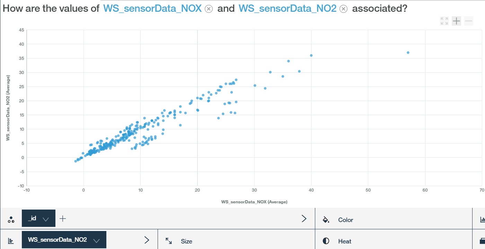

---

copyright:
  years: 2017
lastupdated: "2017-09-18"
---

---

{:new_window: target="blank"}
{:shortdesc: .shortdesc}
{:screen: .screen}
{:codeblock: .codeblock}
{:pre: .pre}


# 使用 Watson Analytics 來分析資料
{: #WA_integration}  

您可以搭配使用 {{site.data.keyword.iot_full}} 與 Watson Analytics (WA)，以視覺化並瞭解從連接至平台之裝置送出的資料。
{: shortdesc}

## 概觀及目標

本手冊會引導您逐步執行使用 Watson Analytics (WA) 作為分析工具來視覺化 {{site.data.keyword.iot_short_notm}} 裝置事件資料的程序。

您可以使用 {{site.data.keyword.cloudantfull}} NoSQL DB 服務，將傳送至 {{site.data.keyword.iot_short_notm}} 的裝置資料收集並儲存在 {{site.data.keyword.Bluemix}}。若要收集資料，您必須先將 {{site.data.keyword.iot_short_notm}} 連接至 {{site.data.keyword.cloudant_short_notm}} 服務。收集資料之後，請將資料匯出至 CSV 檔案。您可以將此檔案上傳至 WA，以在其中視覺化及分析裝置資料。根據配置的儲存區間隔，將裝置資料儲存在 {{site.data.keyword.cloudant_short_notm}} 每日、每週或每月資料庫。


在本手冊中，您將學習：

 - 如何配置平台資料儲存空間，以將 Cloudant NoSQL DB 用來作為歷程服務。
 - 如何使用 Weather Sensors 模擬器來產生平台所要使用的資料。
 - 如何匯出資料，然後將資料匯入至 WA 來分析資料。


## 必要條件

若要完成這些步驟，您必須能夠存取 [{{site.data.keyword.iot_short_notm}} ](https://console.bluemix.net/catalog/services/internet-of-things-platform){: new_window} 與 [Cloudant NoSQL DB ](https://console.bluemix.net/catalog/services/cloudant-nosql-db
){: new_window}，以及存取 [Watson Analytics ](https://www.ibm.com/watson-analytics){: new_window}。


## 步驟 1. 設定模擬器
{: #WA_sensor_data}


若要進行有意義的分析，您必須具有有意義的資料。您可以模擬實際感應器資料，以瞭解如何使用 Watson Analytics 來分析 Watson IoT Platform 裝置資料。此步驟提供下列指示：
 - [設定含**現有 {{site.data.keyword.iot_short_notm}} 實例**的模擬器](#sim_existing_platorm)
 - [設定含**新 {{site.data.keyword.iot_short_notm}} 實例**的模擬器](#sim_new_platform)
 - [下載含資料的預先製作 CSV 範例檔案](#WA_sensor_premade)（如果您不要使用模擬器）


### 設定含現有 {{site.data.keyword.iot_short_notm}} 實例的 Weather Sensors 模擬器
{: #sim_existing_platform}

若要使用 Weather Sensors 模擬器來模擬組織的實際感應器資料事件，您必須先設定模擬器。這些步驟假設您已開始進行 {{site.data.keyword.iot_short_notm}} 實例。

1. [產生執行模擬器所需的 API 金鑰及記號。](https://console.bluemix.net/docs/services/IoT/platform_authorization.html#api-key){: new_window}
2. [部署 Weather Sensors 模擬器 Web 應用程式 ](https://bluemix.net/deploy?repository=https://github.com/ibm-watson-iot/guide-weathersensors-simulator){: new_window}，並遵循詳細指示。

   如需 Weather Sensors 的相關資訊，請參閱 [Weather Sensors 模擬器手冊 ](https://github.com/ibm-watson-iot/guide-weathersensors-simulator){: new_window}。
3. 繼續進行[步驟 2. 配置資料庫連接器](#WA_config_db)。


### 設定含新 {{site.data.keyword.iot_short_notm}} 實例的 Weather Sensors 模擬器
{: #sim_new_platform}

若要使用 Weather Sensors 模擬器來模擬組織的實際感應器資料事件，您必須先設定模擬器。這些步驟包括建立 {{site.data.keyword.iot_short_notm}} 實例與模擬器的指示。

1. [部署含 {{site.data.keyword.iot_short_notm}} 實例的 Weather Sensors 模擬器 Web 應用程式 ](https://bluemix.net/deploy?repository=https://github.com/ibm-watson-iot/guide-weathersensors-simulator&branch=bindwiotp){: new_window}，並遵循詳細步驟。

   如需 Weather Sensors 的相關資訊，請參閱 [Weather Sensors 模擬器手冊 ](https://github.com/ibm-watson-iot/guide-weathersensors-simulator){: new_window}。
2. 等待部署完成，然後導覽至 Bluemix 儀表板。
3. 啟動部署程序所建立的 {{site.data.keyword.iot_short_notm}} 服務 "wiotp-for-weather-sensors-simulator"。
4. 繼續進行[步驟 2. 配置資料庫連接器](#WA_config_db)。


### 從預先製作的範例 CSV 檔案中使用感應器資料
{: #WA_sensor_premade}

若要使用預先製作的 CSV 檔案來模擬組織的實際感應器資料事件，請執行下列動作：

1. [下載 Cloudant CSV 檔案 ](https://github.com/ibm-watson-iot/guide-weathersensors-simulator/releases/download/v1.0/cloudant.csv){: new_window}。
2. 繼續進行[步驟 5. 設定 WA 並視覺化資料](#WA_import_data)。


## 步驟 2. 配置資料庫連接器
{: #WA_config_db}

若要搭配使用 {{site.data.keyword.cloudant_short_notm}} 與 Watson Analytics，您必須配置平台資料儲存空間，以將 Cloudant NoSQL DB 用來作為歷程服務。

1. 在 {{site.data.keyword.cloudant_short_notm}} 儀表板上，按一下導覽列中的**延伸規格**。
2. 在**歷程資料儲存空間**下，按一下**設定**。**配置歷程資料儲存空間**區段會列出與 {{site.data.keyword.cloudant_short_notm}} 相同的 Bluemix 空間內提供的所有 Cloudant NoSQL DB 服務。
3. 選取您要連接的 Cloudant NoSQL DB 服務。
4. 指定下列 Cloudant NoSQL DB 配置選項：
  - 儲存區間隔 = 日
  - 時區 = UTC
  - 資料庫名稱 = default
5. 按一下**完成**，確認「Cloudant 服務」連線的授權。請確定在瀏覽器中已啟用蹦現視窗，以存取確認視窗。若已順利配置 Cloudant NoSQL DB，「歷程資料儲存空間」狀態會變更為「已配置」，而且裝置資料會儲存在 {{site.data.keyword.cloudant_short_notm}} NoSQL DB。
6. 繼續進行[步驟 3. 執行模擬器](#run_simulator)。


## 步驟 3. 執行模擬器
{: #run_simulator}

模擬器會將實際天氣感應器資料（來自位於「海法」區域的 17 個氣象站）發佈至您的 {{site.data.keyword.iot_short_notm}} 組織。

1. 導覽至模擬器。
2. 輸入下列詳細資料：
   - Watson IoT Platform 組織
   - API 金鑰
   - 鑑別記號

3. 按一下**執行模擬器**。產生資料需要幾分鐘的時間。
4. 在模擬器執行時移至 Watson IoT Platform，並驗證裝置已建立，而且事件將進入這些裝置。 
5. 繼續進行[步驟 4. 匯出 Cloudant 資料庫](#WA_export_csv)。


## 步驟 4. 匯出 Cloudant 資料庫
{: #WA_export_csv}

在配置 {{site.data.keyword.cloudant_short_notm}} NoSQL DB 來儲存裝置資料時，連接器會自動建立三個資料庫。一個資料庫是針對現行儲存區間隔建立、一個是針對即將到來的間隔建立，還有一個是針對配置資料庫建立。到達間隔結尾時，新間隔的裝置資料會儲存在儲存區資料庫，並會為後續儲存區建立新的資料庫。

{{site.data.keyword.cloudant_short_notm}} 中的「歷程資料儲存空間」延伸規格特性會在 Cloudant 中建立稱為 "iotp" 的設計文件。此文件的「清單」功能稱為 "csv"，可用來將裝置事件（儲存為 Cloudant 中的文件）匯出為 CSV 格式。只有 JSON 格式的事件才會傳送至 CSV 檔案。此設計文件會自動傳播至即將到來的儲存區間隔的每個新資料庫。

CSV 檔案包含裝置事件 meta 資料及其有效負載的相關資訊。下列清單顯示事件 meta 資料的範例：
 -	DeviceId
 -	DeviceType
 - 	EventType
 - 	Timestamp（ISO 8601 格式）

CSV 清單函數會將原始時間戳記分成兩個新的個別「時間」和「日期」欄位。除了 meta 資料之外，CSV 清單函數還包括裝置有效負載的資料屬性。此有效負載顯示在 Cloudant 文件的 "data" 索引鍵下。Weather Sensors 模擬器所產生文件的結構類似於下列範例：

```
{"deviceType": "WS",
  "deviceId": "Old-Market",
  "eventType": "sensorData",
  "format": "json",
  "timestamp": "2017-08-09T16:28:14.666Z",
  "data": { "NO2": 3.2, … }}
```

在產生的 CSV 檔案中，所有有效負載屬性都會呈現為直欄，而且會在它們前面附加：

```
<deviceType>_<eventType>_  
```

在上述範例中，會將名為 WS_sensorData_NO2 的直欄新增至 CSV 檔案。

若要將 Cloudant 資料庫匯出為 CSV 格式，請執行下列動作：  

1. 登入 Cloudant NoSQL DB。
2. 選取要匯出的資料庫。
3. 開啟選取的資料庫。
4. 在瀏覽器中開啟新的標籤，然後鍵入下列 URL：
   ```
   https://{cloudant service id}-bluemix.cloudant.com/{dbName}/_design/iotp/_list/csv/by-date?include_docs=true
```
   Cloudant 服務 ID 及 dbName 必須根據 Cloudant 服務 ID 及選取的資料庫名稱進行變更。Cloudant 服務 ID 可以從 Cloudant 管理儀表板 URL 中進行複製。

   **範例：**
   ```
   https://ccf73725-b617-4f3e-8a7e-f5fb09569af4-bluemix.cloudant.com/iotp_115ccv_default_2017-08-23/_design/iotp/_list/csv/by-date?include_docs=true
   ```

   在此範例中，將會依時間戳記排序資料，因為是使用依日期視圖來呼叫清單函數。您也可以使用 Cloudant 視圖原生過濾器特性來過濾資料，方法是變更 URL 中所使用的視圖，並套用 startkey 及 endkey 屬性。

   **範例：**
   ```
   https://{cloudant service id}-bluemix.cloudant.com/{dbName}/_design/iotp/_list/csv/by-deviceType?include_docs=true&startkey='WS'&endkey='WS'
   ```
   在此範例中，使用 deviceType 視圖來產生 csv，而且下載的檔案中只會包括含 deviceType=WS 的文件。若要選取特定時間範圍內的文件，請使用依日期視圖，並使用下列查詢 URL（取代所需範圍的時間戳記）：
   ```
   https://{cloudant service id}-bluemix.cloudant.com/{dbName}/_design/iotp/_list/csv/by-date?statkey="2017-08-29T12:25:50.995Z"&endkey="2017-08-29T12:25:51.514Z"
   ```
5. 必要的話，請提供 Cloudant 認證，並下載 CSV 檔案。檔名是根據 URL 中所定義的視圖所產生。例如，檔名可能是 by-date.csv 或 by-deviceType.csv。
6. 繼續進行[步驟 5. 設定 WA 並視覺化資料](#WA_import_data)。


## 步驟 5. 設定 WA 並視覺化資料
{: #WA_import_data}

若要設定 WA，並開始視覺化資料，請執行下列動作：

1. 在 https://watson.analytics.ibmcloud.com 登入 WA。
2. 在 WA 首頁上，選取**資料**。
3. 按一下**本端檔案**，以匯入您的本端 CSV 檔案。CSV 檔案名稱取決於您用來匯出資料的視圖（例如，by-deviceType 或 by-date）。
4. 選取已上傳的 CSV 資料資產。
5. 在**詢問有關資料的問題**欄位中，使用自然語言提出問題。
5. 開啟最符合您問題的視覺化建議。您可以手動修訂建議。
7. 儲存視覺化。


## 使用 WA 視覺化資料的範例
{: #WA_visualize}

本節顯示使用 WA 作為分析工具來分析資料的範例。

**附註：**這些範例旨在提供您在執行自己的視覺化時所預期動作的構想。這裡所顯示範例的結果可能不同於您在使用範例資料執行這些視覺化時所看到的結果（例如，因不同日期和時間所產生的資料）。

### 視覺化裝置性能

在本節中，我們將瞭解 IoT 裝置的母體，以及回答下列問題：

1. 已報告多少個裝置？
2. 每種裝置類型的裝置分解是什麼？
3. 裝置有多少份報告？
4. 每一個裝置已傳送多少份報告？

**已報告多少個裝置？**

在此範例中，我們會計算所指定間隔期間報告的裝置數目，以偵測是否如預期報告裝置。若要完成此分析，請在 WA 中複製並貼上或者鍵入下列問題：

*"How many deviceId are there?"*

以下結果顯示有 17 個裝置：


**每種裝置類型的裝置分解是什麼？**

在此範例中，我們會比較每種裝置類型在間隔期間報告的裝置數目，以判斷是否如預期報告所有裝置類型的裝置。若要完成此分析，請在 WA 中複製並貼上或者鍵入下列問題：

*"How does the number of deviceId compare by deviceType?"*

以下結果顯示每種裝置類型的裝置分解：


若要以圓餅圖檢視此資料，請按一下左側的**視覺化**，然後選取**圓餅圖**。


**裝置有多少份報告？**

在此範例中，我們會計算裝置已產生的報告數目，以偵測網路狀況及其他裝置相關問題。若要完成此分析，請在 WA 中複製並貼上或者鍵入下列問題：

*"How many rows are there? filtered by deviceId: Ahuza"*

**附註：**您不需要鍵入完整欄位名稱。WA 會嘗試猜測完整欄位名稱，但過濾器值（例如："Ahuza"）的拼寫必須完整且正確。如果您使用過濾器時看不到正確的建議，請按一下**顯示下一個**鏈結，或嘗試 *"How many rows are there?"* 問題。然後，開啟圖表，按一下圖表下方的**乘數**方框，然後從清單中選取 deviceId 參數。請取消勾選所有不相關的 deviceId。

此結果顯示裝置 Ahuza 已產生 25 列或 25 份報告：


**每一種不同的裝置有多少份報告？**

在此範例中，我們會根據每一個裝置在檢查期間所傳送的報告數目，來比較裝置的活動層次。若要完成此分析，請在 WA 中複製並貼上或者鍵入下列問題：

*"How does the number of Rows compare by deviceId?"*

此結果顯示具有不同裝置之裝置活動的長條圖：


### 視覺化裝置類型感應器資料

在本節中，我們將瞭解某裝置類型的所有裝置所報告的摘要感應器資料，以及回答下列問題：

1. 所有已報告感應器值的平均值/最小值/最大值為何？
2. 我可以看見感應器輸出的直方圖嗎？  
3. 兩個感應器之間的相關性為何？


**所有已報告感應器值的平均值/最小值/最大值為何？**

在此範例中，我們會將裝置類型中所有裝置已報告的數值參數彙總至表格。在這份表格中，我們可以瞭解在環境中感應到的值範圍，並對感應到的資料有廣泛的認識。

您必須使用下列步驟來手動建置此視覺化：

1.	在**建立自己的視覺化**區段中，選取**表格**。
2.	按一下「建立新的直欄」加號按鈕，然後選取**計算**。
3.	命名新直欄，從**直欄**下拉清單中選取此計算的直欄，然後按一下**完成**以複製直欄。新的直欄即會新增至資料匣右側。
4.	用滑鼠右鍵按一下新直欄的標題，選取聚集類型（最小值、最大值或平均值），然後關閉內容視窗。
6.	重複此程序以新增其他直欄，然後隱藏資料匣。
7.	按一下**直欄**，然後選取清單底端的**測量**。
8.	按一下**聚集方式**，然後選取您所新增的所有計算。
9.	按一下**完成**。
10.	儲存視覺化。

以下結果顯示值範圍：


**我可以檢視裝置感應器輸出的直方圖嗎？**

在此範例中，我們會評估裝置類型中所有裝置之感應器的行為，並識別在環境中感應到之值的分佈。我們可以使用此視覺化來瞭解感應器所感應到的環境，以及感應器中的限制。若要完成此分析，請在 WA 中複製並貼上或者鍵入下列問題：

*"How does the number of Rows compare by TEMP?"*

此結果顯示列數的比較：


**兩個感應器之間的相關性為何？**

在此範例中，我們藉由比較裝置類型之所有裝置中兩個裝置感應器的測量，來瞭解環境中的相關性。若要完成此分析，請在 WA 中複製並貼上或者鍵入下列其中一個問題：

*"What is the relationship between NO2 and NOX?"* 或 *"How are the values of NO2 and NOX associated?"*

以下結果顯示兩個感應器之間的關係：



您也可以使用每個裝置 ID 的色點來檢視感應器資料。若要這麼做，請在**顏色**方框中選取 deviceID。

以下結果顯示有限的裝置子集：


### 視覺化感應器詳細資料（深入探索）

在本節中，我們將研究特定裝置所報告的特定參數，並回答下列問題：

1.	平均/最小/最大已報告值為何？
2.	我可以看見裝置感應器輸出的直方圖嗎？
3.	特定裝置感應器值如何隨著時間變更？
4.	如何比較兩個裝置一段時間的感應器值？
5.	如何比較相同裝置一段時間的感應器值？
6.	裝置之兩個感應器之間的相關性為何？


**平均/最小/最大已報告值為何？**

在此範例中，我們會將特定裝置已報告的數值參數彙總至表格，以瞭解環境中感應到的值範圍或感應器故障（舉例來說）。

您必須使用下列步驟來手動建置此視覺化：

1)	在**建立自己的視覺化**區段中，選取**表格**。
2)	按一下「建立新的直欄」加號按鈕，然後選取**計算**。
3)	命名新直欄，從**直欄**下拉清單中選取此計算的直欄，然後按一下**完成**以複製直欄。新的直欄即會新增至資料匣右側。
4)	用滑鼠右鍵按一下新直欄的標題，選取聚集類型（最小值、最大值或平均值），然後關閉**內容**視窗。
6)	重複此程序以新增其他直欄，然後隱藏資料匣。
7)	按一下**直欄**，然後選取**測量**。
8)	按一下**聚集方式**，然後選取您所新增的所有計算。
9)	按一下**完成**。
10)	在乘數方框中，選取 deviceId 參數，然後選取要顯示的相關裝置。
11)	儲存視覺化。

此結果顯示指定的值：


**我可以看見裝置感應器輸出的直方圖嗎？**

在此範例中，我們會評估特定裝置感應器的行為，並識別在環境中感應到之值的分佈。我們可以使用此視覺化來瞭解感應器所感應到的環境，以及感應器中潛在的故障。若要完成此分析，請在 WA 中複製並貼上或者鍵入下列其中一個問題：

*"What is the distribution of TEMP? filtered by deviceId: Ahuza"* 或 *"How does the number of Rows compare by TEMP? filtered by deviceId: Ahuza"*

此結果顯示直方圖中的裝置感應器輸出資料：


**特定裝置感應器值如何隨著時間變更？**

在此範例中，我們學習特定裝置的特定感應器讀數如何變更，並反映環境中一段時間的變更。這有助於規劃及偵測問題。若要完成此分析，請在 WA 中複製並貼上或者鍵入下列問題：

*"What is the trend of TEMP over time? filtered by deviceId: Ahuza".*

此結果顯示一段時間的感應器資料趨勢：


**如何比較兩個裝置一段時間的感應器值？**

在此範例中，我們將比較不同裝置的感應器讀數趨勢，並識別裝置之間的關係來偵測異常、裝置故障等等。若要完成此分析，請在 WA 中複製並貼上或者鍵入下列其中一個問題：

*"What is the trend of TEMP over time by deviceId?"* 或 *"What is the trend of TEMP over time by deviceId?  filtered by deviceId: Ahuza, Igud"*

此結果顯示一段時間的感應器值比較：


您也可以藉由按一下圖表底端的參數名稱來檢視此資訊。繪製多條線（一個 deviceId 一條線）。您可以從清單中選取相關的 deviceId。


您可以使用圖表下面的**乘數**方框，並選擇 deviceId，以並列顯示圖表。


**如何比較相同裝置一段時間的感應器值？**

在此範例中，我們將相互視覺化兩個裝置感應器的趨勢，以深入瞭解環境在一段時間的變更。若要完成此分析，請在 WA 中複製並貼上或者鍵入下列問題：

*"What is the trend of NO2 and NOX over time by deviceId?  filtered by deviceId: Ahuza"*

此結果顯示兩個裝置感應器在一段時間的趨勢：


**裝置之兩個感應器之間的相關性為何？**

在此範例中，我們藉由比較兩個裝置感應器的測量，來瞭解環境中的相關性。若要完成此分析，請在 WA 中複製並貼上或者鍵入下列其中一個問題：

*"What is the relationship between NO2 and NOX? filtered by deviceId: Ahuza"* 或 *"How are the values of NO2 and NOX associated? filtered by deviceId: Ahuza"*

此結果顯示裝置的兩個感應器之間的相關性：


## 下一步為何？

如需 WA 的相關資訊，請參閱下列資源：
- [Watson Analytics 開發人員中心 ](https://developer.ibm.com/watson-analytics/){: new_window}
- [Watson Analytics 社群 ](https://www.ibm.com/communities/analytics/watson-analytics/){: new_window}
- [Watson Analytics 討論區 ](https://community.watsonanalytics.com/discussions/spaces/15/view.html){: new_window}
