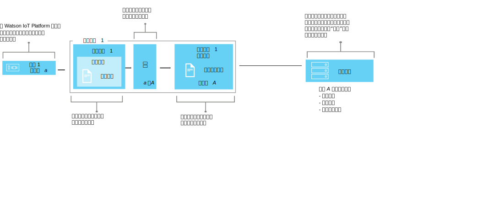

---

copyright:
  years: 2016, 2017
lastupdated: "2017-10-09"

---

{:new_window: target="\_blank"}
{:shortdesc: .shortdesc}
{:screen: .screen}
{:codeblock: .codeblock}
{:pre: .pre}


# 了解数据管理
{: #definitions_resources}
您可能具有多个要连接到 {{site.data.keyword.iot_full}} 的不同设备，这些设备可能会以不同的格式发布数据。通过使用数据管理功能，您可以将设备输出的数据规范化并变换为应用程序可以轻松使用的单个逻辑视图。通过使用单个逻辑视图，可以无需对应用程序进行编码，即可了解每个设备输出的不同数据格式。
{: shortdesc}

## 概述

使用数据管理功能来创建设备（双联设备）的共享抽象，以改进复用和维护，并在保证应用程序不受数据更改影响的情况下，管理 IoT 生态系统的复杂性。 

通过使用 HTTP API 或预订主题字符串，应用程序可以在请求时访问设备的当前状态。状态由逻辑接口所定义的一组状态属性组成。如果由于将事件发布到 {{site.data.keyword.iot_short_notm}} 而导致设备的状态发生更改，那么会更新这些属性的值并将其存储在 {{site.data.keyword.iot_short_notm}} 中。

通过使用数据管理功能，可实现以下优势：
- 将状态属性映射到事件消息数据
- 定义首选的数据结构
- 定义设备状态的多种表示或视图
- 预订设备状态或随时通过 HTTP API 对其进行查询

实施数据管理功能的一些常见用例包括：
- 为应用程序开发者提供一致的接口以通过类似 REST 的方式访问事件驱动的设备数据
- 对来自不同制式或型号并且以不同的格式发布数据的设备的数据进行规范化
- 修改并转换数据格式以适合应用程序模型

## 示例 1：将异构温度传感器映射到逻辑接口
{: #device-type-example}
要开始使用数据管理功能，需要定义以下各部分中描述的大量资源。 

以下示例显示可以如何整合这些资源，以支持应用程序以一种格式访问同类温度状态数据，而不考虑设备事件消息有效内容的格式。温度传感器 1 将摄氏温度读数 `{ "t" : 34.5 }` 发布到 {{site.data.keyword.iot_short_notm}}。温度传感器 2 发布的是华氏温度读数 `{ "temp" : 72.55 }`。每个温度传感器都与其自己的[设备类型](../reference/device_model.html#id_and_device_types)相关联。这些温度读数会作为单独的事件发布。

使用 {{site.data.keyword.iot_short_notm}} 数据管理功能来帮助您通过规范化并转换设备数据来配置此解决方案。 


作为数据流的一部分，您可以对传入的数据执行计算以对这些读数进行规范化，使其格式一致，以便进行处理。这意味着您无需将应用程序编写为能够识别或转换不同的温标。应用程序会收到单一的规范化状态，并使用 **temperature** 状态属性而不是特定于设备的 **t** 和 **temp** 属性。

 要配置此解决方案，您需要定义以下信息：

-	来自每个设备类型的入站温度事件的结构，“t”和“temp”。  
-	要记录的属性“temperature”。“temperature”属性定义可由应用程序使用的设备状态的逻辑结构。
-	您希望如何将入站事件的属性“t”和“temp”映射到属性“temperature”。

您可以通过配置 {{site.data.keyword.iot_short_notm}} 中存在的以下资源来定义必需的信息：

-	物理接口、事件类型和事件模式资源，用于定义入站事件“t”和“temp”的结构。
-	逻辑接口和逻辑模式资源，用于定义要生成的设备状态“temperature”的逻辑结构。
-	映射资源，用于定义如何将属性“t”和“temp”映射至属性“temperature”。

有关描述此示例的详细端到端方案，请参阅[逐步指南：有关如何通过公共接口使用设备的详细示例](ga_im_index_scenario.html)。

“定义资源”一节中提供了有关这些资源的更多详细信息。


## 定义资源
{: #definitions_resources}

下图说明了在使用数据管理功能时，{{site.data.keyword.iot_short_notm}} 上设备与应用程序之间的逻辑映射。



### 概念
{: #concepts}
下表描述了先前图中引用的事件、属性和状态的概念。

概念| 描述

------------- | ------------- | -------------  
事件| 事件是设备将数据发布到 {{site.data.keyword.iot_short_notm}} 时所采用的机制。设备控制事件内容，并为其发送的每个事件指定名称。
属性| 带有部分设备事件有效内容的数据。

状态| 这是物理设备状态的最新表示，它可以包括已从多个入站事件映射的所有属性。

### 数据管理资源
{: #resources}

您可以使用 REST API 来管理资源。有关 REST API 的信息，请参阅 [{{site.data.keyword.iot_short_notm}} HTTP REST API](https://docs.internetofthings.ibmcloud.com/apis/swagger/v0002/state-mgmt.html) 文档。

类型资源| 描述

------------- | ------------- | -------------  
事件类型| 使用事件类型资源对设备发布的事件进行建模。事件类型必须引用事件模式资源。模式资源定义所发布事件的结构。
</br>**重要事项：**逻辑接口中使用的入站事件必须为 JSON 格式。
设备类型|  使用设备类型资源对共享特征或行为的设备进行分组。在数据管理中，设备类型扩展为包括设备的一个物理接口以及用于检索设备状态的一个或多个逻辑接口。</br>有关更多信息，请参阅[设备模型](../reference/device_model.html#id_and_device_types)主题中的“标识和设备类型”部分。

模式资源|  使用模式资源来定义事件或设备状态的结构。使用下列 [JSON 模式 ](http://json-schema.org/){:new_window}：<ul><li>与事件类型相关联的模式。此模式用于定义由设备发布到 {{site.data.keyword.iot_short_notm}} 的事件的结构。这些模式称为事件模式。<li>与逻辑接口相关联的模式。此模式用于定义存储在 {{site.data.keyword.iot_short_notm}} 上的设备状态的结构。这些模式称为逻辑接口模式</ul>.  

接口资源| 描述

------------- | ------------- | -------------  
逻辑接口| 应用程序可以连接或预订的用于查看设备状态的程序化构造。逻辑接口用于将规范化视图定义到 {{site.data.keyword.iot_short_notm}} 中的设备状态。逻辑接口必须与逻辑接口模式相关联。状态会进行更新以对入站设备事件做出响应。
物理接口| 物理接口用于对物理设备与 {{site.data.keyword.iot_short_notm}} 之间的接口进行建模。事件类型可以与物理接口相关联。

实例资源| 描述

------------- | ------------- | -------------  
设备| 设备表示向 {{site.data.keyword.iot_short_notm}} 注册的资产、系统或组件，并以事件形式发送 IoT 数据。

支持资源| 描述

------------- | ------------- | -------------  
映射| 使用映射定义与入站事件关联的属性如何映射到在逻辑接口上定义的属性。
</br>**重要信息：**必须至少将一个逻辑接口与一种设备类型相关联后，才能定义映射。


## 资源的命名限制
{: #naming_restrictions}
模式、事件类型以及逻辑和物理接口具有以下命名限制：
- 名称长度必须在 1 - 128 个字符之间 
- 名称必须包含 Unicode 字符 
- 有效的特殊字符包括空格、连字符 ( - )、下划线 ( _ ) 和句点 ( .)
- 名称不能仅包含空格

## 创建、更新、激活和取消激活资源
{: #draft_active_resources}

可以有两个版本的资源：草稿版本和活动版本。创建资源时，该资源将创建为草稿版本。
{: shortdesc}

草稿版本是资源的工作副本，您可以使用 API 对其直接进行查询、更新和删除。通过激活草稿设备类型或草稿逻辑接口，来创建草稿资源的活动版本。只能激活草稿设备类型或草稿逻辑接口资源。要激活其他资源（例如模式），必须激活引用要激活的资源的草稿设备类型或草稿逻辑接口。

要在使用 REST API 时区分草稿和活动资源，前缀 *draft/* 用于标识处于草稿状态的资源。

以下示例通过使用指定标识来检索草稿模式定义的元数据：

```
GET /api/v0002/draft/schemas/{schemaId}
```
以下示例通过使用指定标识来检索活动模式定义的元数据：
```
GET /api/v0002/schemas/{schemaId}
```
*注意：*对于给定资源的草稿版本和活动版本，此标识是相同的。


- 激活资源
{: #activate_resources}  

使用 **activate-configuration** 操作来验证并激活与设备类型相关联的配置。此配置包括草稿模式、事件类型、物理接口、逻辑接口和映射。**activate-configuration** 操作必须在逻辑接口或设备类型的草稿版本上执行。

以下示例显示了 PATCH 请求，其中对设备类型的草稿版本执行 **activate-configuration** 操作：
```
PATCH /api/v0002/draft/device/types/TemperatureSensor
```
其中，PATCH 主体的有效内容包含以下内容：
```
  {
    "operation": "activate-configuration"
  }
```
- 列出差异
{: #list_differences}  

使用 **list-differences** 操作，可以针对逻辑接口或设备类型资源，返回活动和草稿配置之间的任何差异列表。**list-differences** 操作必须在逻辑接口或设备类型的草稿版本上执行。以下示例显示了 PATCH 请求，其中对设备类型的草稿版本执行 **list-differences** 操作：
```
PATCH /api/v0002/draft/device/types/TemperatureSensor
```
其中，PATCH 主体的有效内容包含以下内容：
```
  {
    "operation": "list-differences"
  }
```


- 取消激活资源  
{: #deactivate_resources}  

使用 **deactivate-configuration** 操作来除去与资源相关联的活动配置。deactivate-configuration 操作只能在逻辑接口和设备类型的活动版本上执行。以下示例显示了 PATCH 请求，其中对设备类型的活动版本执行 **deactivate-configuration** 操作：
```
PATCH /api/v0002/device/types/TemperatureSensor
```
其中，PATCH 主体的有效内容包含以下内容：
```
  {
    "operation": "deactivate-configuration"
  }
```
*注：*
- 活动资源为只读。您可以使用查询参数来过滤草稿和活动资源并对其进行排序。
- 如果存在与设备类型关联的设备实例，那么无法删除该设备类型。删除设备实例时，将清除设备的状态。 
- 直接使用 API 只能激活逻辑接口和设备类型。如果其他资源（例如，模式、物理接口和事件类型）由处于活动的逻辑接口或设备类型引用，那么将会激活这些资源。  
- **activate-configuration** 操作必须在与设备类型关联的逻辑接口的草稿版本上执行，或在设备类型本身上执行。**activate-configuration** 操作会检查在激活资源之前资源配置是否有效。一旦成功完成激活，就会为设备类型的每个设备实例生成状态。

## 对配置进行故障诊断
{: #troubleshooting}
如果激活失败，请检查是否已提供给定设备类型的所有必需配置。必须提供以下配置，且配置必须与设备类型相关联：
  - 至少与一个事件关联的物理接口
  - 至少一个逻辑接口
  - 至少其中一个关联逻辑接口的映射

您还可以对设备类型或逻辑接口资源的草稿版本执行 **validate-configuration** 操作，以确保相关联的元数据有效。如果元数据无效，那么将在响应的主体中返回问题列表。  

以下示例显示了 PATCH 请求，其中对名为“TemperatureSensor”的设备类型的草稿版本执行 **validate-configuration** 操作：  
```
PATCH /api/v0002/draft/device/types/TemperatureSensor
```
其中，PATCH 主体的有效内容包含以下内容：
```
  {
    "operation": "validate-configuration"
  }
```  
以下示例显示了对 PATCH 请求的不成功响应：  
```
{
"message": "CUDIM0303I: State update configuration for Device Type 'TemperatureSensor' is not valid.",
"details": {
  "id": "CUDIM0303I",
  "properties": [
    "Device Type",
    "TemperatureSensor"
  ]
},
"failures": [
  {
    "message": "CUDVS0301E: The device type 'TemperatureSensor' does not have any mappings defined for it",
    "details": {
      "id": "CUDVS0301E",
      "properties": [
        "TemperatureSensor"
      ]
    }
  }
]
}
```  
以下示例显示对 PATCH 请求的成功响应：  
```  
{
"message": "CUDIM0303I: State update configuration for Device Type 'TemperatureSensor' is valid.",
"details": {
  "id": "CUDIM0303I",
  "properties": [
    "Device Type",
    "TemperatureSensor"
  ]
},
 "failures": []
}
```  
如果所有必需资源都与设备类型相关联，请检查属性映射是否有效。以下示例显示可能发生的错误：

  - 表达式引用了未由事件模式定义的事件上的属性
  - 表达式引用了未由逻辑接口模式定义的状态上的属性
  - 为未由逻辑接口模式定义的属性定义了映射


您可以参阅以下错误日志，来帮助您诊断运行时错误：
```
iot-2/type/${typeId}/id/${devieId}/err/data
```
### 资源限制

下表显示可基于套餐类型配置的最大资源数。 

资源                   |标准套餐                  | Lite 套餐
------------- | ------------- | ------------- 
逻辑接口| 1000 | 10
物理接口| 1000 | 5
事件类型| 1000 | 10
模式|2000 | 20
逻辑接口引用（设备类型可映射到的逻辑接口数）|20 | 5
事件类型引用（物理接口可以具有的事件类型关联的事件标识数）| 40 | 10
