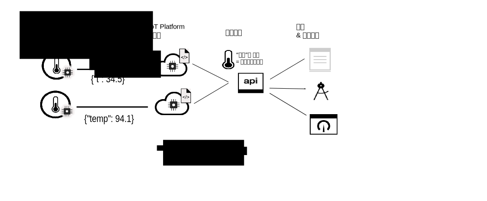

---

copyright:
years: 2017, 2018
lastupdated: "2018-08-28"

---

{:new_window: target="\_blank"}
{:shortdesc: .shortdesc}
{:screen: .screen}
{:codeblock: .codeblock}
{:pre: .pre}

# 数据管理简介
{: #device_twins}

<!--An unprecedented number of devices and sensors exist in the modern world. Connected devices generate vast amounts of digital data at extraordinary speeds. Such volumes of data represent great opportunities but also challenges, in terms of how big data can be processed, analyzed and presented to help to deliver insights and drive transformation.-->

设备可以提供类似的数据输出，但 make、model 和 version 中的内容各不相同，并且可以输出不同格式的数据。例如，办公室中具有温度传感器的设备可能会以华氏度或摄氏度为单位报告温度。将应用程序配置为能够使用所有这些格式的数据并不是高效的方法；相反，需要收集、转换和规范化数据，以创建单个逻辑模型，以便应用程序能够以相同的方式与不同设备进行交互。 

{{site.data.keyword.iot_short_notm}} 的数据管理组件包含双联设备和双联资产功能。通过双联设备功能，可以收集不同格式的设备数据，并将其转换和规范化为单个逻辑模型。通过双联资产功能，可以将不同设备分组在一起以创建一个事物，这是基于更高价值资产的数据结构。您甚至可以将多个事物分组在一起以创建新的事物。应用程序可以与该逻辑模型进行交互，而不考虑各个设备或事物使用的数据格式。 

例如，一组温度、湿度和环境光线报告设备可以聚合到一个“房间”事物中，用于表示特定办公室内的舒适程度。多个“房间”事物可以聚合到一个“楼层”事物中，用于表示在特定楼层的所有办公室，并且多个“楼层”事物可以聚合到一个“建筑物”事物中。通过使用事物抽象，应用程序可与设备连接方式的细节、设备发布事件数据的格式以及数据的组合方式相分离。
{: shortdesc}

## 双联设备

双联设备是连接到 {{site.data.keyword.iot_short_notm}} 的物理设备的基于云的数字表示。双联设备表示设备所发布事件的逻辑模型。定义并实例化后，无论设备处于联机还是脱机状态，双联设备都会提供一致的方式，以类似 REST 的方式与设备进行交互。设备的属性（包括设备当前状态信息（设备状态））可通过使用 HTTP 请求或预订 IoT 主题进行检索。

双联设备可以帮助您：
- 为应用程序开发者提供一致的接口以通过类似 REST 的方式访问事件驱动的设备数据。
- 访问设备的状态。
- 对来自不同制式或型号并且以不同的格式发布数据的设备的数据进行规范化。
- 过滤掉不需要的数据。

要创建双联设备，需要在 {{site.data.keyword.iot_short_notm}} 中定义以下资源：
- 设备所发送事件的结构。  
入站事件的结构在物理接口、事件类型和事件模式资源中定义。 
- 要记录的属性。  
这些属性定义应用程序可以使用的设备状态的逻辑结构。这些属性在逻辑接口和逻辑模式资源中定义。  
- 物理接口事件到逻辑接口属性的映射。  
使用映射资源将事件映射至属性。

下图显示了位于不同位置的两个不同的温度设备。一个设备报告以摄氏度为单位的设备数据，另一个设备报告以华氏度为单位的数据。数据会以“t”和“temp”的温度格式发送到 {{site.data.keyword.iot_short_notm}}。{{site.data.keyword.iot_short_notm}} 会自动将华氏度转换为摄氏度。“t”和“temp”温度格式会规范化为“temperature”逻辑格式。应用程序可以通过访问“temperature”参数的值来查询任一设备的状态。 

## 双联资产（事物）

通过双联资产，您可进一步了解双联设备的概念。双联资产支持将设备聚合到称为“事物”的单个实体中。事物（即双联资产）是与双联设备类似的概念，但双联资产将一组设备表示为单个逻辑模型。您甚至可以聚合事物以形成更高级别的抽象。例如，“房间”事物可聚合以下设备：

- 具有温度传感器的设备（温度计）
- 具有湿度传感器的设备（湿度计）

随后，“楼层”事物可聚合多个“房间”事物。 

事物的结构使用 JSON 模式进行定义。该模式引用聚合的设备或事物的逻辑接口。事物的属性（包括事物当前状态信息）可通过使用 HTTP 请求或预订 IoT 主题进行检索。

双联资产可以帮助您：
 
- 将多个双联设备或事物聚合在一起，以定义新的事物。
- 访问事物的状态。
- 管理资产，而不必分别检测这些资产。
- 过滤掉不需要的数据。
- 将对事物接口进行规范化，使应用程序与特定事物构造方式的复杂细节相分离。

要创建双联资产，需要在 {{site.data.keyword.iot_short_notm}} 中定义以下资源：

- 事物的结构。  
事物的结构由用于指定聚合的设备或事物的事物模式进行定义。
- 所需事物状态的结构，这由要记录的属性组成。  
这些属性定义应用程序可以使用的事物状态的逻辑结构。这些属性在逻辑接口和逻辑模式资源中定义。  
- 事物接口事件如何映射到逻辑接口属性。  
使用映射资源将事件映射至属性。

下图显示了将温度和湿度事件数据发布到 {{site.data.keyword.iot_short_notm}} 的不同设备上的温度和湿度传感器。两个双联设备（每个设备表示一个物理设备）具有关联的逻辑接口，并且在 {{site.data.keyword.iot_short_notm}} 中进行创建。从温度设备发布的数据会映射到“IThermometer”逻辑接口。从湿度设备发布的数据会映射到“IHygrometer”逻辑接口。这两个逻辑接口会聚合到使用“IRoom”逻辑接口的*房间*事物类型中。“IRoom”逻辑接口定义温度和湿度属性，支持您通过将多个设备聚合到应用程序可以与之进行交互的单个事物中来创建自己的逻辑模型。  

**重要信息：**{{site.data.keyword.iot_short_notm}} 事物功能只作为受限 Beta 程序的一部分提供。未来更新可能会包含与此功能当前版本不兼容的更改。请尝试此功能，[让我们了解您的想法 ](https://developer.ibm.com/answers/smart-spaces/17/internet-of-things.html){: new_window}。

有关定义和配置密钥信息和资源的更多信息，请参阅[了解数据管理](ga_im_definitions.html)。 

## 后续步骤

- 在 {{site.data.keyword.iot_short_notm}} 中创建自己的双联设备。有关更多信息，请参阅[使用 Web 界面开始进行数据管理](im_ui_flow.html)文档。 
- 使用 REST API 创建双联设备和双联资产。有关更多信息，请参阅[数据管理入门](../information_management/getting_started_things.html)文档。  
- 创建在 {{site.data.keyword.iot_short_notm}} 收到与指定条件或条件集匹配的事件数据时触发的规则。有关更多信息，请参阅[嵌入式规则](../information_management/im_rules.html) Beta 文档。

有关*数据管理入门*文档中概述的每个步骤的更详细信息，请参阅以下主题中记录的示例场景： 

- [逐步指南 1：有关如何通过公共接口使用设备的详细示例](ga_im_index_scenario.html#scenario) 
- [逐步指南 2：有关如何通过公共接口使用事物的详细示例](../information_management/im_index_scenario_thing.html#scenario) 

