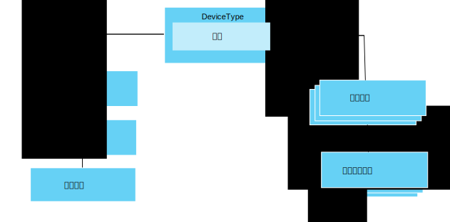

---

copyright:
years: 2016, 2017
lastupdated: "2017-07-21"

---

{:new_window: target="\_blank"}
{:shortdesc: .shortdesc}
{:screen: .screen}
{:codeblock: .codeblock}
{:pre: .pre}

# 数据管理入门
{: #im_example}

使用以下步骤来帮助您配置开始使用数据管理功能所需的资源。

有关 API 的详细信息，请参阅 [{{site.data.keyword.iot_full}} HTTP REST API ](https://docs.internetofthings.ibmcloud.com/apis/swagger/v0002/state-mgmt.html){:new_window} 文档。

**提示：**有关每个步骤的更多详细信息，请参阅示例场景或使用链接直接转至逐步指南中的特定步骤。[逐步指南：有关如何通过公共接口使用设备的详细示例](ga_im_index_scenario.html#scenario)将指导您完成为异构温度计设备创建设备类型逻辑接口的步骤。

## 开始之前
要开始使用数据管理功能，必须至少有一个已向 {{site.data.keyword.iot_short_notm}} [注册的设备](ga_im_index_scenario.html#step14)，并向其发送数据。  

下图显示需要如何将资源配置在一起的逻辑视图：

## 步骤

1. 	定义传入状态属性。  
定义您希望逻辑接口为应用程序提供的传入状态属性。  
<dl>
<dd>
<ol>
<li>[创建草稿事件模式文件](ga_im_index_scenario.html#step1)。事件模式文件是本地 .JSON 文件，用于定义入站事件的结构和格式。
<li>[创建事件类型的草稿事件模式资源](ga_im_index_scenario.html#step2)。事件模式资源是 {{site.data.keyword.iot_short_notm}} 所使用的程序化构造。
<li>[创建引用事件模式的草稿事件类型](ga_im_index_scenario.html#step3)。事件类型由 {{site.data.keyword.iot_short_notm}} 使用，用于将一个或多个事件模式资源映射到物理接口。
<li>[创建草稿物理接口](ga_im_index_scenario.html#step7)。
<li>[向草稿物理接口添加事件类型](ga_im_index_scenario.html#step8)。
<li>[更新草稿设备类型以连接草稿物理接口](ga_im_index_scenario.html#step9)。</ol>
</dd>
</dl>
4. 	创建草稿逻辑接口。
 1. 	为草稿设备类型[创建草稿逻辑接口模式文件](ga_im_index_scenario.html#step4)。  
逻辑接口模式文件是本地 .JSON 文件，用于定义向应用程序提供的设备状态。
 2. 为草稿设备类型[创建草稿逻辑接口模式资源](ga_im_index_scenario.html#step5)。
 3.	为草稿设备类型[创建草稿逻辑接口](ga_im_index_scenario.html#step6)。
 4.	[将草稿逻辑接口添加到草稿设备类型](ga_im_index_scenario.html#step10)。
5. 	为草稿设备类型[定义草稿映射](ga_im_index_scenario.html#step11)。   
映射用于将入站属性映射到逻辑接口中的属性。
6. 	[验证并激活配置](ga_im_index_scenario.html#step15)（与草稿设备类型相关联）。
7. 	[检索活动设备的状态](ga_im_index_scenario.html#step13)。  
验证预订中是否显示已更新的设备数据，或者是否已使用 REST 调用或预订主题返回已更新的设备数据。
