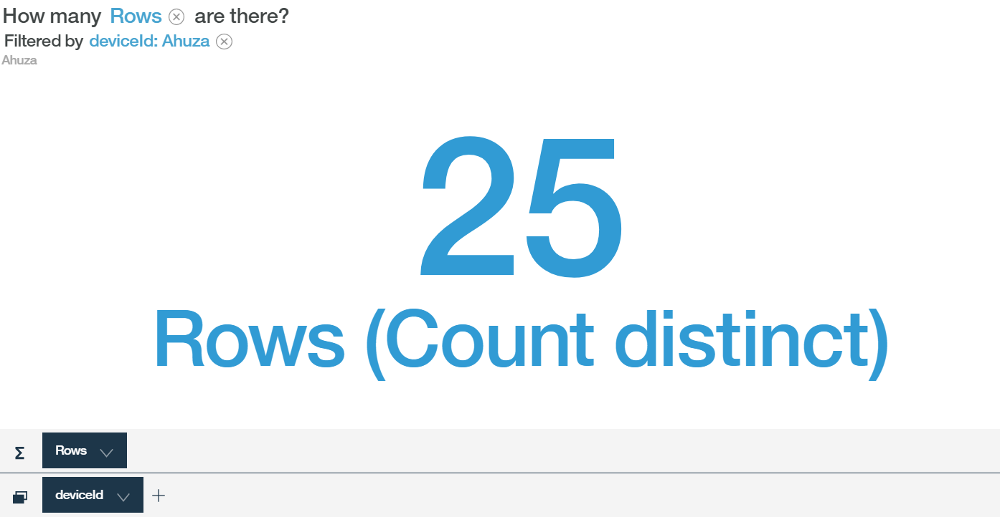

---

copyright:
  years: 2017
lastupdated: "2017-09-18"
---

---

{:new_window: target="blank"}
{:shortdesc: .shortdesc}
{:screen: .screen}
{:codeblock: .codeblock}
{:pre: .pre}


# 使用 Watson Analytics 分析数据
{: #WA_integration}  

您可以将 {{site.data.keyword.iot_full}} 与 Watson Analytics (WA) 配合使用，以可视化并了解从连接到平台的设备发送的数据。
{: shortdesc}

## 概述和目标

本指南逐步指导您完成通过将 Watson Analytics (WA) 用作分析工具来可视化 {{site.data.keyword.iot_short_notm}} 设备事件数据的过程。

可以使用 {{site.data.keyword.cloudantfull}} NoSQL DB 服务来收集发送到 {{site.data.keyword.iot_short_notm}} 的设备数据并将其存储在 {{site.data.keyword.Bluemix}} 中。要收集数据，必须首先将 {{site.data.keyword.iot_short_notm}} 连接到 {{site.data.keyword.cloudant_short_notm}} 服务。收集数据后，将数据导出到 CSV 文件。您可以将此文件上传到 WA，您可以在其中对设备数据进行可视化和分析。根据配置的存储区时间间隔，设备数据存储在 {{site.data.keyword.cloudant_short_notm}} 每日、每周或每月数据库中。


作为本指南的一部分，您将了解：

 - 如何配置平台数据存储，以便将 Cloudant NoSQL DB 用作历史服务。
 - 如何使用天气传感器模拟器来生成要由平台使用的数据。
 - 如何导出数据，然后将数据导入 WA 以分析数据。


## 先决条件

要完成这些步骤，您必须具有使用 [Cloudant NoSQL DB ](https://console.bluemix.net/catalog/services/cloudant-nosql-db
) 对 [{{site.data.keyword.iot_short_notm}}](https://console.bluemix.net/catalog/services/internet-of-things-platform){: new_window}的访问权{: new_window}，以及对 [Watson Analytics ](https://www.ibm.com/watson-analytics){: new_window} 的访问权。


## 步骤 1. 设置模拟器
{: #WA_sensor_data}


为了执行有意义的分析，您必须具有有意义的数据。您可以模拟真实的传感器数据，以了解如何使用 Wastson Analytic 来分析 Watson IoT Platform 设备数据。此步骤提供以下内容的指示信息：
 - [使用 **{{site.data.keyword.iot_short_notm}} 的现有实例**设置模拟器](#sim_existing_platorm)
 - [使用 **{{site.data.keyword.iot_short_notm}} 的新实例**设置模拟器](#sim_new_platform)
 - [使用数据下载预制作的 CSV 样本文件](#WA_sensor_premade)（如果您不想使用模拟器）


### 使用 {{site.data.keyword.iot_short_notm}} 的现有实例设置天气传感器模拟器
{: #sim_existing_platform}

要使用天气传感器模拟器，针对组织来模拟实时传感器数据事件，必须首先设置模拟器。以下步骤假设您已经具有已启动并在运行的 {{site.data.keyword.iot_short_notm}} 实例。

1. [生成运行模拟器所需的 API 密钥和令牌。](https://console.bluemix.net/docs/services/IoT/platform_authorization.html#api-key){: new_window}
2. [部署天气传感器模拟器 Web 应用程序 ](https://bluemix.net/deploy?repository=https://github.com/ibm-watson-iot/guide-weathersensors-simulator){: new_window}，并遵循详细指示信息。

   有关天气传感器的更多信息，请参阅[天气传感器模拟器指南 ](https://github.com/ibm-watson-iot/guide-weathersensors-simulator){: new_window}。
3. 继续执行[步骤 2. 配置数据库连接器](#WA_config_db)。


### 使用 {{site.data.keyword.iot_short_notm}} 的新实例设置天气传感器模拟器
{: #sim_new_platform}

要使用天气传感器模拟器，针对组织来模拟实时传感器数据事件，必须首先设置模拟器。以下步骤包括用于随模拟器创建 {{site.data.keyword.iot_short_notm}} 实例的指示信息。

1. [使用 {{site.data.keyword.iot_short_notm}} 的实例部署天气传感器模拟器 Web 应用程序 ](https://bluemix.net/deploy?repository=https://github.com/ibm-watson-iot/guide-weathersensors-simulator&branch=bindwiotp){: new_window}，并执行详细步骤。

   有关天气传感器的更多信息，请参阅[天气传感器模拟器指南 ](https://github.com/ibm-watson-iot/guide-weathersensors-simulator){: new_window}。
2. 等待部署完成，然后浏览到 Bluemix 仪表板。
3. 启动由部署过程创建的 {{site.data.keyword.iot_short_notm}} 服务“wiotp-for-weather-sensors-simulator”。
4. 继续执行[步骤 2. 配置数据库连接器](#WA_config_db)。


### 使用预制样本 CSV 文件中的传感器数据
{: #WA_sensor_premade}

要使用预制 CSV 文件，针对组织来模拟实时传感器数据事件，请执行以下操作：

1. [下载 Cloudant CSV 文件 ](https://github.com/ibm-watson-iot/guide-weathersensors-simulator/releases/download/v1.0/cloudant.csv){: new_window}。
2. 继续执行[步骤 5. 设置 WA 并可视化数据](#WA_import_data)。


## 步骤 2 . 配置数据库连接器
{: #WA_config_db}

要将 {{site.data.keyword.cloudant_short_notm}} 与 Watson Analytics 一起使用，必须配置平台数据存储，以便将 Cloudant NoSQL DB 用作历史服务。

1. 在 {{site.data.keyword.cloudant_short_notm}} 仪表板上，单击导航栏中的**扩展**。
2. 在**历史数据存储**下，单击**设置**。**配置历史数据存储**部分列出了与 {{site.data.keyword.cloudant_short_notm}} 相同的 Bluemix 空间中可用的所有 Cloudant NoSQL DB 服务。
3. 选择要连接的 Cloudant NoSQL DB 服务。
4. 指定以下 Cloudant NoSQL 数据库配置选项：
  - 存储区时间间隔 = 天
  - 时区 = UTC
  - 数据库名称 = 缺省值
5. 单击**完成**并确认与 Cloudant 服务的连接的授权。请确保浏览器中启用了弹出窗口，以便能够访问确认窗口。成功配置 Cloudant NoSQL DB 后，“历史数据存储”状态将更改为“已配置”，并且设备数据会存储在 {{site.data.keyword.cloudant_short_notm}} NoSQL DB 中。
6. 继续执行[步骤 3. 运行模拟器](#run_simulator)。


## 步骤 3. 运行模拟器
{: #run_simulator}

模拟器会将位于海法地区的 17 个气象站中的实际天气传感器数据发布到您的 {{site.data.keyword.iot_short_notm}} 组织。

1. 浏览到模拟器。
2. 输入以下详细信息：
   - Watson IoT Platform 组织
   - API 密钥
   - 认证令牌

3. 单击**运行模拟器**。生成数据需要几分钟时间。
4. 在模拟器运行时转至 Watson IoT Platform，并验证是否已创建设备，以及事件是否要传入这些设备。 
5. 继续执行[步骤 4. 导出 Cloudant 数据库](#WA_export_csv)。


## 步骤 4. 导出 Cloudant 数据库
{: #WA_export_csv}

配置 {{site.data.keyword.cloudant_short_notm}} NoSQL DB 以存储设备数据时，连接器会自动创建三个数据库。针对当前存储区时间间隔，会创建一个数据库，针对即将到来的时间间隔和配置数据库也会各创建一个数据库。等到时间间隔结束时，设备数据会针对新时间间隔存储在存储区数据库中，并会为后续存储区创建一个新的数据库。

{{site.data.keyword.cloudant_short_notm}} 中的“历史数据存储”扩展功能会在 Cloudant 中创建一个名为“iotp”的设计文档。本文档有一个称为“csv”的“列表”功能，可用于将以 Cloudant 的文档形式存储的设备事件导出为 CSV 格式。只有 JSON 格式的事件才会发送到 CSV 文件。此设计文档在即将到来的存储区时间间隔内，将自动传播到每个新数据库中。

CSV 文件包含有关设备事件元数据及其有效内容的信息。以下列表显示事件元数据的示例：
 -	DeviceId
 -	DeviceType
 - 	EventType
 - 	ISO 8601 格式的时间戳记

csv 列表功能将原始时间戳记分成两个新的单独的“时间”和“日期”字段。除了元数据之外，CSV 列表功能还包括设备有效内容的数据属性。此有效内容显示在 Cloudant 文档中的“data”键下。由天气传感器模拟器生成的文档具有类似于以下示例的结构：

```
{"deviceType": "WS",
  "deviceId": "Old-Market",
  "eventType": "sensorData",
  "format": "json",
  "timestamp": "2017-08-09T16:28:14.666Z",
  "data": { "NO2": 3.2, … }}
```

在生成的 CSV 文件中，所有有效内容属性都以列的形式表示，并且会添加以下内容的前缀：

```
<deviceType>_<eventType>_  
```

在以上示例中，会将名为 WS_sensorData_NO2 的列添加到 CSV 文件。

要将 Cloudant 数据库导出为 CSV 格式：  

1. 登录到 Cloudant NoSQL DB。
2. 选择要导出的数据库。
3. 打开选定的数据库。
4. 在浏览器中打开一个新选项卡，然后输入以下 URL：
   ```
   https://{cloudant service id}-bluemix.cloudant.com/{dbName}/_design/iotp/_list/csv/by-date?include_docs=true
```
   必须根据 Cloudant 服务标识和所选数据库名称来更改 Cloudant 服务标识和 dbName。可以从 Cloudant 管理仪表板 URL 复制 Cloudant 服务标识。

   **示例：**
   ```
   https://ccf73725-b617-4f3e-8a7e-f5fb09569af4-bluemix.cloudant.com/iotp_115ccv_default_2017-08-23/_design/iotp/_list/csv/by-date?include_docs=true
   ```

在此示例中，数据将按时间戳记排序，因为“截止日期”视图用于调用列表功能。您还可以通过更改 URL 中使用的视图并应用 startkey 和 endkey 属性，使用 Cloudant 视图本机过滤器功能来过滤数据。
   **示例：
**
   ```
   https://{cloudant service id}-bluemix.cloudant.com/{dbName}/_design/iotp/_list/csv/by-deviceType?include_docs=true&startkey='WS'&endkey='WS'
   ```
在此示例中，使用了 deviceType 视图来生成 csv，而只有 deviceType=WS 的文档才包含在下载的文件中。要选择特定时间范围内的文档，请使用截止日期视图并使用以下查询 URL（替换所需范围的时间戳记）：
   ```
   https://{cloudant service id}-bluemix.cloudant.com/{dbName}/_design/iotp/_list/csv/by-date?statkey="2017-08-29T12:25:50.995Z"&endkey="2017-08-29T12:25:51.514Z"
   ```
5. 根据需要提供 Cloudant 凭证，然后下载 CSV 文件。文件名是根据 URL 中定义的视图生成的。例如，文件名可以是 by-date.csv 或 by-deviceType.csv。
6. 继续执行[步骤 5. 设置 WA 并可视化数据](#WA_import_data)。


## 步骤 5. 设置 WA 并可视化数据
{: #WA_import_data}

要设置 WA 并开始可视化数据，请执行以下操作：

1. 登录到 WA，网址为：https://watson.analytics.ibmcloud.com。
2. 在 WA 主页上，选择**数据**。
3. 单击**本地文件**，以导入您的本地 CSV 文件。CSV 文件名取决于您用于导出数据的视图（例如，by-deviceType 或 by-date）。
4. 选择您上传的 CSV 数据资产。
5. 在**询问有关您数据的问题**字段中，使用自然语言提出问题。
5. 打开与问题最匹配的可视化建议。您可以手动修改建议。
7. 保存可视化。


## 使用 WA 可视化数据的示例
{: #WA_visualize}

本节显示了使用 WA 作为分析工具来分析数据的示例。

**注：**这些示例旨在让您了解在执行自己的可视化时会发生什么情况。此处显示的示例中的结果可能与您使用样本数据执行这些可视化时看到的结果不同，这是因为在不同日期和时间收集数据（举例来说）。

### 可视化设备运行状况

在本节中，我们将了解 IoT 设备的移入情况，并回答如下问题：

1. 已报告多少设备？
2. 每种设备类型的设备明细是什么？
3. 设备有多少个报告？
4. 每个设备发送了多少报告？

**已报告多少设备？**

在此示例中，我们计算在指定时间间隔中报告的设备数，以检测设备是否已按预期报告。要完成此分析，请复制并粘贴或在 WA 中输入以下问题：

*“存在多少 deviceId？”*

以下结果显示存在 17 个设备：


**每种设备类型的设备明细是什么？**

在此示例中，我们将对在时间间隔期间报告的每种设备类型的设备数进行比较，以确定来自所有设备类型的设备是否已按预期报告。要完成此分析，请复制并粘贴或在 WA 中输入以下问题：

*“如何按 deviceType 比较 deviceId 的数量？”*

以下结果显示每种设备类型的设备明细：


要在饼图中查看此数据，请单击左侧的**可视化**，然后选择**饼图**。


**设备有多少个报告？**

在此示例中，我们将对设备进行的报告的数量进行计数，以检测网络条件和其他与设备相关的问题。要完成此分析，请复制并粘贴或在 WA 中输入以下问题：

*“存在多少行？按 deviceId Ahuza 过滤”*

**注：**您不需要输入完整的字段名称。WA 会尝试猜测完整的字段名，但是过滤器值（例如“Ahuza”）必须完整且拼写正确。如果您在使用过滤器时看不到正确的建议，请单击**显示下一个**链接或尝试问题*“存在多少行？”*。 然后，打开图，单击图下方的**乘数**框，然后从列表中选择 deviceId 参数。取消选中所有不相关的 deviceId。

此结果显示设备 Ahuza 生成 25 行或报告：




**每个不同的设备有多少个报告？**

在本示例中，我们根据每个设备在检验时间间隔期间发送的报告数，来比较设备的活动级别。要完成此分析，请复制并粘贴或在 WA 中输入以下问题：

*“如何按 deviceId 比较行数？”*

此结果显示具有不同设备的设备活动的条形图：


### 可视化设备类型传感器数据

在本节中，我们将了解某种设备类型的所有设备所报告的摘要传感器数据，并回答如下问题：

1. 所有报告的传感器值的平均值/最小值/最大值是多少？
2. 我能查看传感器输出的直方图吗？  
3. 两个传感器之间的关联是什么？


**所有报告的传感器值的平均值/最小值/最大值是多少？**

在本示例中，我们将某个设备类型中所有设备所报告的数字参数汇总到一个表中。从此表中，我们可以了解环境中已检测到的值的范围，并对已检测的数据有一个广泛的了解。

此可视化必须使用以下步骤手动构建：

1.	在**创建自己的可视化**部分中，选择**表**。
2.	单击“创建新列”加号按钮，然后选择**计算**。
3.	命名新列，从**列**下拉列表中选择此计算的列，然后单击**完成**以复制该列。新的列将添加到数据托盘的最右端。
4.	右键单击新列的标题，选择汇总类型（最小值、最大值或平均值），然后关闭属性窗口。
6.	重复该过程以添加更多列，然后隐藏数据托盘。
7.	单击**列**，然后选择列表底部的**度量**。
8.	单击**汇总依据**，然后选择您添加的所有计算。
9.	单击**完成**。
10.	保存可视化。

以下结果显示值的范围：


**我能查看设备传感器输出的直方图吗？**

在此示例中，我们将评估设备类型中所有设备上的传感器行为，从而识别在环境中检测到的值的分布。我们可以使用此可视化来了解传感器所检测到的环境以及传感器限制。要完成此分析，请复制并粘贴或在 WA 中输入以下问题：

*“如何按 TEMP 比较行数？”*

此结果显示行数的比较：


**两个传感器之间的关联是什么？**

在此示例中，通过比较设备类型的所有设备上的两个设备传感器的测量值，了解环境中的相关性。要完成此分析，请复制并粘贴或在 WA 中输入以下其中一个问题：

*“NO2 与 NOX 之间有何关系？”*或*“NO2 和 NOX 的值是如何关联的？”*

此结果显示两个传感器之间关系：


您还可以通过每个设备标识使用彩色点来查看传感器数据。要执行此操作，请在**颜色**框中选择 deviceID。

此结果显示设备的有限子集：


### 可视化传感器详细信息（深入探究）

在本节中，我们将研究特定设备所报告的特定参数，并回答以下问题：

1.	什么是“平均值/最小值/最大值”报告值？
2.	我能查看设备传感器输出的直方图吗？
3.	特定设备传感器值如何随时间而更改？
4.	两个设备的传感器值如何随时间而比较？
5.	相同设备的传感器值如何随时间而比较？
6.	设备的两个传感器之间有何关联？


**什么是“平均值/最小值/最大值”报告值？**

在此示例中，我们将特定设备所报告的数字参数汇总到一个表中，以了解有关环境中检测到的值范围或传感器的故障（举例来说）。

此可视化必须使用以下步骤手动构建：

1)	在**创建自己的可视化**部分中，选择**表**。
2)	单击“创建新列”加号按钮，然后选择**计算**。
3)	命名新列，从**列**下拉列表中选择此计算的列，然后单击**完成**以复制该列。新的列将添加到数据托盘的最右端。
4)	右键单击新列的标题，选择汇总类型（最小值、最大值或平均值），然后关闭**属性**窗口。
6)	重复该过程以添加更多列，然后隐藏数据托盘。
7)	单击**列**并选择**度量**。
8)	单击**汇总依据**，然后选择您添加的所有计算。
9)	单击**完成**。
10)	在乘数框中，选择 deviceId 参数并选择要显示的相关设备。
11)	保存可视化。

此结果显示指定的值：


**我能查看设备传感器输出的直方图吗？**

在此示例中，我们将评估特定设备传感器的行为，从而识别在环境中检测到的值的分布。我们可以使用此可视化来了解传感器所检测到的环境以及传感器中的潜在故障。要完成此分析，请复制并粘贴或在 WA 中输入以下其中一个问题：

*“什么是 TEMP 的分布？按 deviceId Ahuza”过滤*或*“如何按 TEMP 比较行数？按 deviceId Ahuza 过滤”*

此结果在直方图中显示设备传感器输出数据：


**特定设备传感器值如何随时间而更改？**

在此示例中，我们将了解特定设备的特定传感器的读数如何随着时间的变化反映环境中的更改。这有助于进行规划和问题检测。要完成此分析，请复制并粘贴或在 WA 中输入以下问题：

*“TEMP 随时间变化的趋势是什么？按 deviceId Ahuza 过滤”。*

此结果显示一段时间内的传感器数据趋势：


**两个设备的传感器值如何随时间而比较？**

在此示例中，我们将比较不同设备的传感器读数的趋势，确定设备之间的关系，以检测异常情况、设备故障等。要完成此分析，请复制并粘贴或在 WA 中输入以下其中一个问题：

*“TEMP 按 deviceId 随时间变化的趋势是什么？* 或*“TEMP 按 deviceId 随时间变化的趋势是什么？按 deviceId Ahuza、Igud 过滤”*

此结果显示一段时间内的传感器值比较：


您还可以通过单击图表底部的参数名称来查看此信息。绘制了多行（每个 deviceId 一行）。可以从列表中选择相关 deviceId。


您可以使用图表下方的**乘数**框并选择 deviceId 并排显示图表。


**相同设备的传感器值如何随时间而比较？**

在此示例中，我们相互可视化两个设备传感器的趋势，以便更深入地了解环境随时间的变化。要完成此分析，请复制并粘贴或在 WA 中输入以下问题：

*“NO2 和 NOX 按 deviceId 随时间变化的趋势是什么？按 deviceId Ahuza 过滤”*

此结果显示一段时间内两个设备传感器的趋势：


**设备的两个传感器之间有何关联？**

在此示例中，我们通过比较来自两个设备传感器的测量值来了解环境中的相关性。要完成此分析，请复制并粘贴或在 WA 中输入以下其中一个问题：

*“NO2 与 NOX 之间有何关系？按 deviceId Ahuza 过滤”*或*“NO2 和 NOX 的值是如何相关的？按 deviceId Ahuza 过滤”*

此结果显示设备的两个传感器之间的关联性：


## 后续步骤

有关 WA 的更多信息，请参阅以下资源：
- [Watson Analytics Developer Center ](https://developer.ibm.com/watson-analytics/){: new_window}
- [Watson Analytics 社区 ](https://www.ibm.com/communities/analytics/watson-analytics/){: new_window}
- [Watson Analytics 论坛 ](https://community.watsonanalytics.com/discussions/spaces/15/view.html){: new_window}
