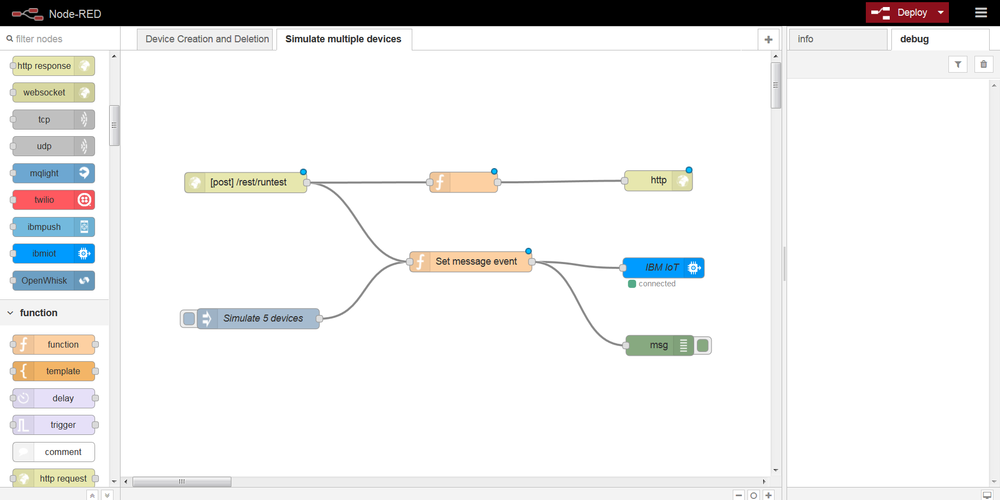

---

copyright:
  years: 2017, 2018
lastupdated: "2018-08-18"

---

{:shortdesc: .shortdesc}
{:new_window: target="_blank"}
{:codeblock: .codeblock}
{:pre: .pre}
{:screen: .screen}
{:tip: .tip}

# 指南 3：模拟大量设备
在第一个指南中，您设置一个基本设备模拟器，用于手动模拟一个或多个传送带。在本指南中，我们通过将大量自运行模拟器添加到环境中，以在更现实的多设备环境中测试分析和监视，从而扩展此模拟。
{:shortdesc}

**重要信息：**该应用程序需要 512 MB 内存，这超过了缺省情况下分配的内存量，并且还超过了可供免费试用帐户（包括 {{site.data.keyword.Bluemix}} 试用帐户和标准帐户）使用的内存量。“预订”和“现买现付”帐户持有者可以将分配的内存量增加到 512 MB。免费试用帐户持有者需要升级到“预订”或“现买现付”帐户。有关 {{site.data.keyword.Bluemix_notm}} 帐户类型的更多信息，请参阅[帐户类型](/docs/pricing/index.html#pricing)。

**注：**Bluemix 现在为 IBM Cloud。有关更多详细信息，请参阅 [IBM Cloud 博客](https://www.ibm.com/blogs/bluemix/2017/10/bluemix-is-now-ibm-cloud/){: new_window} 。

## 概述和目标
{: #overview}

在本指南中，您将使用 [Node-RED ](https://nodered.org){: new_window}“后端”来设置 {{site.data.keyword.Bluemix_notm}} 应用程序，以模拟多个传送带设备。

该应用程序包含以下三个流程：   
1. 创建多个设备。   
2. 模拟并行事件发布。
3. 删除设备。   




通过完成本指南中的指示信息，您将：
- 使用 Cloud Foundry 来部署基于 Node-RED 和已启用 Webhook 的设备模拟器应用程序。
- 使用 API 调用来创建和注册设备、发布设备事件和删除设备。

**重要信息：**模拟将设备数据并行发送到 {{site.data.keyword.iot_full}} 的大量设备可能会用尽大量数据。 

## 先决条件
{: #prereqs}  
您需要以下帐户和工具：

* [{{site.data.keyword.Bluemix_notm}} 帐户](https://console.ng.bluemix.net/registration/)，其具有    
 - 超过 512 MB 的 RAM   
 - 超过 1 GB 的磁盘配额  
 - 两个可用的服务
* [Cloud Foundry 命令行界面 (cf CLI) ](https://github.com/cloudfoundry/cli#downloads){: new_window}  
使用 cf CLI 来部署和管理 {{site.data.keyword.Bluemix_notm}} 应用程序。
* 可选：[Git ](https://git-scm.com/downloads){: new_window}  
如果选择使用 Git 来下载代码样本，那么还必须具有 [GitHub.com 帐户 ](https://github.com){: new_window}。如果没有 GitHub.com 帐户，您还可以将代码下载为压缩文件。

对于后续步骤中的任何 REST 调用，可以使用在 Mozilla 中提供的 cURL 或 REST 客户机附加组件插件。  
{: tip}

## 步骤 1 - 将应用程序部署到 {{site.data.keyword.Bluemix_notm}}
{: #step1}

遵循以下步骤以手动创建和部署应用程序。   

1. 克隆 *Lesson4* 样本应用程序 GitHub 存储库。  
使用您最喜欢的工具来克隆以下存储库：  
https://github.com/ibm-watson-iot/guide-conveyor/tree/master/device-simulator
在 Git Shell 中，使用以下命令：
```bash
$ git clone https://github.com/ibm-watson-iot/guide-conveyor/tree/master/device-simulator
```
3. 通过编辑 manifest.yml 文件来配置环境的应用程序。  
要编辑的内容：
 - 要使用现有 {{site.data.keyword.iot_short_notm}} 服务，请更新 `lesson4-simulate-iotf-service` 的所有实例，以反映服务名称。例如，如果您正在使用来自指南 1 的 {{site.data.keyword.iot_short_notm}} 服务，请使用 `iotp-for-conveyor` 作为服务名称。    
 - 设置设备名和主机。   
在应用程序部分中，将 `name` 和 `host` 条目更改为唯一的项，例如 `YOUR_NAME-lesson4-simulate`。   
**提示：**用于访问应用程序的 ROUTES URL 是从 `host` 条目创建的，例如：`https://YOUR_APP_NAME-lesson4-simulate.mybluemix.net`。  
<pre><code>
declared-services:
    lesson4-simulate-cloudantNoSQLDB:
     label: cloudantNoSQLDB
     plan: Lite
    lesson4-simulate-iotf-service:
     label: iotf-service
     plan: iotf-service-free
applications:  </br>
  -  path: .
      memory: 512M
      instances: 1
      domain: mybluemix.net
      name: lesson4-simulate
      host: lesson4-simulate
      disk_quota: 1024M</br>
  services:</br>
     - lesson4-simulate-cloudantNoSQLDB
     - lesson4-simulate-iotf-service
</code></pre>  
1. 在命令行中，通过运行 cf api 命令来设置 API 端点。   
将 `API-ENDPOINT` 值替换为您区域的 API 端点。
   ```
cf api API-ENDPOINT
   ```
示例：`cf api https://api.ng.bluemix.net`  
<table>
<tr>
<th>区域</th>
<th>API 端点</th>
</tr>
<tr>
<td>美国南部</td>
<td>https://api.ng.bluemix.net</td>
</tr>
<tr>
<td>英国</td>
<td>https://api.eu-gb.bluemix.net</td>
</tr>
 <!--<tr>
 <td>Germany</td>
 <td>https://api.eu-de.bluemix.net</td>
 </tr>-->
</table>
2. 登录到 {{site.data.keyword.Bluemix_notm}} 帐户。
  ```
cf login
  ```
如果出现提示，请选择要在其中部署 {{site.data.keyword.iot_short_notm}} 和样本应用程序的组织和空间。
6. 在 {{site.data.keyword.Bluemix_notm}} 中创建所需的服务。   
 1. 使用以下命令来创建 cloudantNoSQLDB 轻量服务：
<pre><code>$ cf create-service cloudantNoSQLDB Lite lesson4-simulate-cloudantNoSQLDB</code></pre>    
 2. 使用以下命令来创建 {{site.data.keyword.iot_short_notm}} 服务。
<pre><code>$ cf create-service iotf-service iotf-service-free lesson4-simulate-iotf-service </code></pre>   
**重要信息：**如果使用现有 {{site.data.keyword.iot_short_notm}} 服务，并且相应地更新了 manifest.yml 文件，请确保使用现有服务名称。例如，从指南 1 中，在 cf 调用中使用 `iotp-for-conveyor` 代替 `lesson4-simulate-iotf-service`。
7. 运行 `cf push` 命令以构建项目并推送到您的组织。  
已在 {{site.data.keyword.Bluemix_notm}} 上部署样本应用程序。  
部署完成后，将显示一条消息以指示应用程序正在运行。   
示例：  
  ```
requested state: started
instances: 1/1
usage: 512M x 1 instances
urls: lesson4-simulate.mybluemix.net
last uploaded: Tue May 30 13:22:17 UTC 2017
stack: cflinuxfs2
buildpack: SDK for Node.js(TM) (ibm-node.js-4.8.2, buildpack-v3.12-20170505-0656
)

     state     since                    cpu     memory           disk
details
#0   running   2017-05-30 09:25:41 AM   23.9%   194.9M of 512M   378.4M of 1G
  ```
8. 获取应用程序的服务凭证。
 1. 登录到 {{site.data.keyword.Bluemix_notm}}，网址为：  
 [https://bluemix.net ](https://bluemix.net){: new_window}。
 2. 选择部署应用程序的帐户和空间。
 3. 在菜单中，选择**应用程序**，然后选择**仪表板**。
 4. 在 Cloud Foundry 应用程序下，单击您刚部署的应用程序的名称。
 4. 选择**连接**。
 5. 找到要与应用程序一起使用的 iotf-service，然后单击**查看凭证**。  
 6. 在服务凭证页面上，找到 `apiKey` 和 `apiToken`。   
使用应用程序 API 来创建和运行模拟设备时，会将 API 密钥和认证令牌用作凭证。

## 步骤 2 - 保护 Node-RED 流程
{: #step2}

虽然此步骤是可选的，但最好是保护 Node-RED 流程。

1. 保护编辑器，以便只有授权用户可以访问它。
2. 要保护 Node-RED 流程，请转至 {{site.data.keyword.Bluemix_notm}} 仪表板，然后选择先前部署的应用程序。
3. 单击**运行时**，然后单击**环境变量**。
4. 添加以下用户定义的环境变量及其相应的值：
    a. NODE_RED_USERNAME
    b. NODE_RED_PASSWORD
5. 保存该流程。

当 Node-RED 流程安全时，如果计划使用 REST API 命令来创建、删除或模拟多个设备，那么必须在基本认证期间提供 Node-RED 用户名和密码凭证。

## 第 3 步 - 创建并连接设备
{: #step3}

您可以使用 Node-RED 流程接口或应用程序 REST API 来完成以下任务。

### 使用 Node-RED 创建和连接设备  
要注册多个设备：  
1. 登录到 {{site.data.keyword.Bluemix_notm}}，网址为：  
[https://bluemix.net ](https://bluemix.net){: new_window}。
2. 选择部署应用程序的帐户和空间。
3. 在菜单中，选择**应用程序**，然后选择**仪表板**。
4. 在 Cloud Foundry 应用程序下，单击您刚部署的应用程序的 **ROUTE** URL。  
ROUTE_URL 是从您在 manifest.yml 文件中使用的 `host` 条目构建的：`HOST.mybluemix.net`  
示例：`https://YOUR_APP_NAME-lesson4-simulate.mybluemix.net`。  
此时 Node-RED 界面将打开。
5. 单击**转至 Node-RED 流程编辑器**。
6. 在流编辑器中，选择**设备类型和实例**选项卡。
7. 要注册 5 个设备，请单击标签为**注册 5 个 motorController 设备**的注入节点。

### 使用 REST API 创建和连接设备  
要注册多个设备：  

1. 对以下 URL 发出 HTTP POST 请求：`ROUTE_URL/rest/devices`  
示例：`https://YOUR_APP_NAME-lesson4-simulate.mybluemix.net/rest/devices`  
 - 将“Content-Type”和“Accept”设置为“application/json”  
 - 使用以下 JSON 有效内容：  
<pre><code>{  </br>
"numberDevices":5, </br>
"typeId":"iotp-for-conveyor",  </br>
"authToken":"mypassword",  </br>
"chunkSize":5,  </br>
"deviceName":"belt"  </br>
}
</code></pre>  
其中：  
    - numberDevices 是用于创建和注册的设备数。
    - 可选：typeId 是要将设备注册为的设备类型。如果未提供 typeId，那么它的缺省值为“iotp-for-conveyor”。**提示：**您可以输入任何设备类型名称，但系列中的其他指南期望设备类型为 `iotp-for-conveyor` 的设备。如果使用其他设备类型，那么必须相应地修改指南中的设置。
    - 可选：authToken 是设备将向其注册的授权令牌。
    - 可选：如果未提供区块大小，那么缺省情况下会将其设置为 500。“chunksize”必须小于和等于 numberDevices 的因子。
    - deviceName 是所创建设备的 deviceID 的模式。

## 步骤 4 - 模拟设备模式
{: #step4}

由于模拟设备已向 {{site.data.keyword.iot_short_notm}} 注册，因此您现在可以运行模拟器以开始发送设备事件。

### 使用 Node-RED 模拟设备事件  
要发送设备事件：  
1. 在 Node-RED 流程编辑器中，选择**模拟多个设备**选项卡。
7. 要模拟 5 个设备，请单击标签为**模拟 5 个设备**的注入节点。
 


### 使用 REST API 模拟设备事件  
要发送设备事件：

1. 对以下 URL 发出 HTTP POST 请求：`ROUTE_URL/rest/runtest`  
示例：`https://YOUR_APP_NAME-lesson4-simulate.mybluemix.net/rest/runtest`  
 - 将“Content-Type”和“Accept”设置为“application/json”  
 - 使用以下 JSON 有效内容：   
<pre><code>{  </br>
"numberDevices":5,  </br>
"numberEvents":10,  </br>
"timeInterval":1000,  </br>
"deviceType":"iotp-for-conveyor",  </br>
"deviceName":"belt"  </br>
}</code></pre>
其中：
    - numberDevices 是用于模拟数据的设备数。
    - numberEvents 是每个模拟设备发送的事件数。
    - timeInterval 是事件的间隔（毫秒）。
    - deviceType 是为其创建模拟设备的设备类型。
    - deviceName 是所创建设备的 deviceID 的模式。
 

## 步骤 5 - 删除设备
{: #deleting}

### Node-RED  
要删除设备：  
1. 在 Node-RED 流程编辑器中，选择**设备类型和实例**选项卡。
2. 要删除五个设备，请单击标注为**删除 5 个设备**的注入节点。


### Rest API  

1. 对以下 URL 发出 HTTP POST 请求：`ROUTE_URL/rest/deleteDevices`  
示例：`https://YOUR_APP_NAME-lesson4-simulate.mybluemix.net/rest/deleteDevices`
 - 将“Content-Type”和“Accept”设置为“application/json”  
 - 使用以下 JSON 有效内容：      
<pre><code>{
"numberDevices":500,   
"deviceType":"iot-conveyor-belt",  
"deviceName": "belt"  
}</code></pre>
  


## 后续步骤
{: @whats_next}  
跳至您感兴趣的其他主题：
- [指南 2：监视设备数据](getting-started-iot-monitoring.html)  
现在，您已连接一个或多个设备并开始充分利用设备数据，现在是时候开始监视设备集合了。
- [了解有关 {{site.data.keyword.iot_short_notm}}](/docs/services/IoT/iotplatform_overview.html){:new_window} 的更多信息
- [了解有关 {{site.data.keyword.iot_short_notm}} API](/docs/services/IoT/reference/api.html){:new_window} 的更多信息
