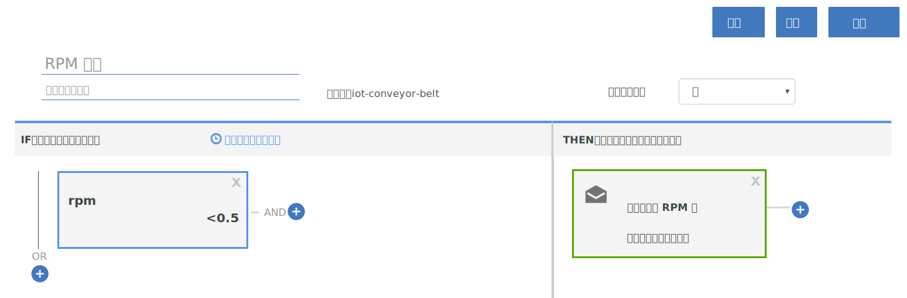

---

copyright:
  years: 2017, 2018
lastupdated: "2018-01-11"

---

{:shortdesc: .shortdesc}
{:new_window: target="_blank"}
{:codeblock: .codeblock}
{:pre: .pre}
{:screen: .screen}
{:tip: .tip}

# 指南 2：使用基本实时规则和操作
使用本指南中的指示信息来配置一组基本规则和操作，用于对传送带 IoT 数据进行一些实时分析。
{:shortdesc}

## 概述和目标
{: #overview}  
既然您已成功设置传送带，将其连接到 {{site.data.keyword.iot_full}} 并发送一些数据，那么是时候通过使用规则和操作来使数据运作。



作为本指南的一部分，您将：
- 为传送带设备事件数据创建消息模式。
- 创建并触发规则。
- 创建电子邮件操作。

## 先决条件
{: #prereqs}  
您必须具有设备类型为 `iot-conveyor-belt` 的已连接设备，该设备发送事件名称为 `sensorData` 的事件，并带有包括以下属性的消息有效内容：
```
{
	"d": {
			"id": "belt1",
		"ts": 1494946276931,
		"ay": "0.00",
		"running": true,
		"rpm": "1.0"
		}
}
```
有关设备事件和消息传递格式的更多信息，请参阅[发布事件](/docs/services/IoT/devices/mqtt.html#publishing_events)。  
如果您已完成[指南 1：{{site.data.keyword.iot_short_notm}} 和模拟传送带入门](getting-started-iot-conveyor.html)，那么表明您已设置完毕。  
{: tip}

## 步骤 1 - 为样本应用程序创建消息模式
{: #create_schema}

要使用设备所发送的属性作为规则的触发器，必须先将这些属性映射到 {{site.data.keyword.Bluemix_notm}} 中的消息传递模式。有关更多信息，请参阅[创建设备类型模式](/docs/services/IoT/im_schemas.html#iotrtinsights_task)。
1. 在 {{site.data.keyword.iot_short_notm}} 仪表板中，转至**设备**并选择**管理模式**。
2. 单击**添加模式**。
3. 选择 **iot-conveyor-belt** 设备类型，然后单击**下一步**。
4. 向模式添加属性。
 1. 单击**添加属性**。
 2. 选择**来自连接的设备**。
 3. 通过更改 rpm 值来发送传送带数据点。在传送带 Web 应用程序中，单击**停止**或**启动**以发布消息。  
属性列表将填充设备发送的属性。
 4. 选择所有属性，然后单击**确定**。
5. 单击**完成**以创建模式。  

模式已创建，rpm 数据类型设置为浮点数。

## 步骤 2 - 为 rpm 属性创建简单规则
{: #create_rule}  
{{site.data.keyword.Bluemix_notm}} 规则引擎将设备所发送的属性数据点与规则中设置的静态阈值进行比较，并在符合规则条件时触发规则。有关规则的更多信息，请参阅[云分析](/docs/services/IoT/cloud_analytics.html#rules)。要创建在传送带 RPM 值小于 0.5 时触发的规则：
1. 将 rpm 属性类型更改为 Float。  
在创建规则时，我们希望将数字 rpm 值与阈值进行比较。为此，必须将此属性识别为浮点数或整数。
 1. 在 {{site.data.keyword.iot_short_notm}} 仪表板中，转至**设备**并选择**管理模式**。
 1. 单击刚刚创建的新模式，然后选择**属性**。
 2. 单击编辑图标以编辑模式。
 3. 单击 `rpm` 属性旁边的编辑图标。
 4. 将数据类型更改为 `Float`。  
 5. 单击**确定**。
 6. 单击**完成**以更新模式。  
2. 创建规则。
 1. 在仪表板中，转至**规则**。
 2. 单击**创建云规则**。
 3. 输入 `RPM 规则`作为名称。
 4. 设置要应用于 **iot-conveyor-belt** 模式的规则。
 5. 单击**下一步**。
 6. 添加规则条件。
    6. 单击**新建条件**磁贴，以添加规则的条件。
    7. 选择 **rpm** 属性。
    8. 选择小于运算符 (`<`)。
    9. 输入 `0.5` 作为值，然后单击**确定**。
    10. 单击**保存**，然后单击**关闭**。
 11. 请单击**关闭**。  
新规则将按“停用”状态列出。
12. 单击状态开关以激活规则。现在，状态列示为“已激活”。

## 步骤 3 - 触发规则
{: #trigger_rule}
通过降低 rpm，您可以使用可能需要操作员干预的传送带来模拟问题。当满足 rpm 的阈值时，将在仪表板中显示警报。
1. 在 {{site.data.keyword.iot_short_notm}} 仪表板中，选择**板**。
3. 选择**规则中心分析**板。
4. 在传送带 Web 应用程序中，将 rpm 值减少到 0.5 rpm 以下。当传感器读数更改时，设备会将数据发送至 {{site.data.keyword.iot_short_notm}}。您可以通过停止、启动或更改传送带的速度来模拟此数据的发送。  
5. 验证 `RPM 规则` 是否显示在“带有警报的规则”卡中。
6. 在“规则警报”卡中选择新警报，然后在“规则警报信息”卡中查看触发规则的数据点。  
要查看有关警报的更多信息，请参阅“关联设备”、“设备信息”和“设备属性”卡中的设备详细信息。  
{: tip}

## 步骤 4 - 创建触发 RPM 规则时要采取的操作
{: #create_action}
除了在 {{site.data.keyword.iot_short_notm}} 仪表板中显示警报外，您还可以创建触发规则时执行的操作，例如，如果 rpm 太低，那么会向操作员发送电子邮件以查看传送带。有关更多信息，请参阅[云分析](/docs/services/IoT/cloud_analytics.html#shared)。要创建电子邮件操作：
1. 在 {{site.data.keyword.iot_short}} 仪表板中，转至**规则**。
2. 单击 **RPM 规则**。
3. 单击**新建操作**磁贴。
4. 创建操作。
 1. 单击**添加操作**。
 2. 输入操作名称 `Notify operator about low RPM`。
 3. 输入描述 `Send an email to the operator`。
 4. 选择**发送电子邮件**类型。
 5. 单击**下一步**。
 6. 在主题行中，输入：`Low RPM alert`。
 7. 在“收件人”字段中，选择**特定人员**，然后输入 `operator@company.com`。  
将电子邮件地址替换为您自己的电子邮件地址。
 8. 选择**包含数据**以在电子邮件中包含设备数据。
 9. 单击**完成**以保存操作。  
5. 选择列表中的操作，然后单击**确定**以设置操作。
6. 单击**保存**以启用该规则的操作。
7. 测试新操作。
 4. 在传送带 Web 应用程序中，将 rpm 值减少到 0.5 rpm 以下。
 5. 验证您已收到警报电子邮件。  
消息体可能类似于以下示例：
> **规则：**RPM 规则  
> **设备：**3m5wxr:iot-conveyor-belt:belt1  
> **日期：**2017-05-09T18:21:21.567Z  
> **条件：**  
> iot_conveyor_belt.d.rpm<0.5  
> **入局消息：**  
> {"d":{"id":"belt1","ts":1494354089837,"ay":"0.00","rpm":"0.4","running":true},"ruleContent":{"jobID":"sdIyBfdu","contextSchemas":[],"ruleDescription":"","severity":4,"messageSchemas":["iot_conveyor_belt"],"disabled":false,"ruleCondition":"iot_conveyor_belt.d.rpm<0.5","transforms":[],"name":"RPM rule","actions":["pziIRovt"],"id":"ncKK4N7k","updated":"9 May 2017 18:20:25 GMT","created":"9 May 2017 17:41:38 GMT","version":7}}  
> 这是自动生成的电子邮件。请勿回复。有关此警报的问题，请与系统管理员联系。

## 后续步骤
{: #whats_next}  
继续执行下一个指南，或跳至您感兴趣的其他主题：
- [指南 3：监视设备数据](getting-started-iot-monitoring.html)  
现在，您已连接一个或多个设备并开始充分利用设备数据，现在是时候开始监视设备集合和它们正在发送的实时数据。
- [指南 4：模拟大量设备](getting-started-iot-large-scale-simulation.html)  
通过路径 A 中的传送带样本应用程序，您可以手动模拟一个或几个传送带设备。本指南使您能够设置具有大量设备的模拟环境。

- [将其他 IoT 设备连接到 {{site.data.keyword.iot_short_notm}}](/docs/services/IoT/iotplatform_task.html)
- [了解有关 {{site.data.keyword.iot_short_notm}}](/docs/services/IoT/iotplatform_overview.html) 的更多信息
- [了解有关 {{site.data.keyword.iot_short_notm}} API](/docs/services/IoT/reference/api.html) 的更多信息
