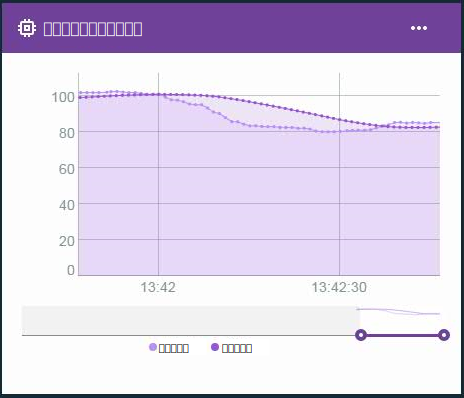

---

copyright:
  years: 2016, 2018
lastupdated: "2018-03-12"

---

{:new_window: target="blank"}
{:shortdesc: .shortdesc}
{:screen:.screen}
{:codeblock:.codeblock}
{:pre: .pre}

# 边缘虚拟属性的高级计算
{: #im_vir_calculations}

**重要信息：**作为更广泛的更改计划的一部分，我们将推出 Beta，以一种全新的方式对 IoT 设备数据定义规则，以改进 {{site.data.keyword.iot_full}} 交付规则和操作的方式。

要了解更多信息，请查看博客帖子 [An alternative approach to defining Rules on IoT data ](https://developer.ibm.com/iotplatform/2018/03/01/alternative-approach-defining-rules-iot-data/){: new_window}。

要开始定义自己的规则，请参阅[创建嵌入式规则 (Beta)](information_management/im_rules.html) 文档。

## 关于边缘虚拟属性的计算

使用预先编写的边缘分析公式扩展基本虚拟属性计算。

仅当所选属性的数据来自连接到网关的设备，并且该网关安装了 Edge Analytics Agent 时，高级计算才会返回属性数据点。边缘规则可以直接使用此虚拟属性。要将属性用于云规则，边缘规则必须使用“转发到云”操作将数据点发送到云。有关更多信息，请参阅[安装 Edge Analytics Agent](gateways/dashboard.html#edge)。

示例：使用折线图卡中的高级虚拟数据点来可视化数据趋势并除去数据峰值。  
 

## 高级公式
{: #advanced}

高级计算选项包括以下公式：

**提示：**对于某些公式，您可以选择时间段长度或要包含的数据点数。如果您确定数据是以一致的频率流动的，那么时段可能比较合适。如果数据是零星或不规则地收集的，那么可能最好是使用数据点数，因为要预测时段很难。

<table>
<thead>
<tr>
<th>公式</th>
<th>描述</th>
<th>用法</th>
</tr>
</thead>
<tbody>
<tr>
<td>平均值</td>
<td>返回近期一定数量的数据点中或者近期一段时间内的属性平均值。  
输入：
<ul>
<li>属性
 <li>时间段长度或数据点数，格式为大于 0 的整数。</ul></td>
 <td>AVG 公式提供在持续移动的某一时段内数据点的平均值。   将平均值公式用于规则可避免根据包含孤立峰值的噪声数据而触发误报。  使用折线图卡来可视化数据趋势并除去数据峰值。  
</td>
</tr>
<tr>
<td>移动 Z 分数</td>
<td>返回在近期一定数量的数据点中或者在近期一段时间内，该数据点与平均数据点值之间的差值（以标准差为单位）。  
输入：
<ul>
<li>属性
<li>时间段长度或数据点数，格式为大于 0 的整数。</ul></td>
<td>某个数据点的“移动 Z 分数”指示该数据点值相对于其近期平均值的异常程度。绝对 Z 分数值越高，说明当前数据点的值与先前平均数据点值的差异越大。
  将“移动 Z 分数”公式用于规则可在数据点值与近期平均值有差异时（而不是在数据点超过特定值时）触发有关快速更改的警报。
  使用折线图卡，通过绘制频率和量级来可视化数据中的波动（以标准差表示）。
</td>
</tr>
<tr>
<td>指数平滑法</td>
<td>返回在收集的可用数据点中属性的平均值，其中属性值以指数形式加权，属性值越旧，权重越小。权重通过平滑因子进行控制，该因子的值越大，将为近期的值赋予越大的权重而为较旧的值赋予越小的权重。  
您还可以选择使用斜率因子来调整数据中的任何趋势。指数平滑值对数据变化的反应要快于移动平均值。  
输入：
<ul>
<li>属性
<li>平滑因子，为大于 0 且小于 1 的数字。  
<li>可选：斜率，为大于 0 且小于 1 的数字。 
 **提示：**如果您不确定收集的数据是否具有趋势，请首先使用斜率 0.5。根据结果，可能需要调整该因子。
 </ul></td>  
 <td>对数据点应用指数平滑法会按以下方式生成平均值：计算平均值（而不是定义时间段长度）时，值越旧，赋予的权重越小。因此，请通过设置更高的平滑因子来限制远期值的权重。
  将指数平滑公式用于规则可使用所有可用数据（而不是其中部分数据）来避免根据包含孤立峰值的噪声数据而触发误报。
  使用折线图卡来可视化数据趋势并除去数据峰值。</td>
</tr>
<tr>
<td>框式平滑法</td>
<td>返回基于以当前数据点为中心的一定范围数据点的属性平均值。  
框式平滑法使用当前所处理数据点前后所配置数量的数据点值来确定其平滑值。框式平滑法在计算中会对所有数据点值赋予相同的权重。  
输入：
<ul>
<li>属性
<li>前后数据点数 (half-width)，格式为大于 0 的整数。
</ul></td>
<td>对数据点应用框式平滑法会返回在持续移动且以相关数据点为中心的某一时段内数据点的平均值。  **重要信息：**根据数据频率和 half-width 值，返回的数据点或多或少会延迟。例如，如果 half-width 设置为 `5`，数据频率为 1 条消息/秒，那么返回的虚拟数据点会延迟 5 秒。  将框式平滑公式用于规则可避免根据包含孤立峰值的噪声数据而触发误报。**重要信息：**创建规则时，请注意数据点延迟。  使用折线图卡来可视化数据趋势并除去数据峰值。
</td>
</tr>
<tr>
<td>高斯平滑法</td>
<td>返回基于以当前数据点为中心的一定范围数据点的属性平均值，其中属性值以指数形式加权，属性值距离当前数据点越远，权重越小。  
输入：
<ul>
<li>属性
<li>前后数据点数 (half-width)，格式为大于 0 的整数。
</ul></td>
<td>对数据点应用高斯平滑法会返回在持续移动且以相关数据点为中心的某一时段内数据点的加权平均值。计算平均值时，数据点距离相关数据点越远，赋予的权重越小。  **重要信息：**根据数据频率和 half-width 值，返回的数据点或多或少会延迟。例如，如果 half-width 设置为 `5`，数据频率为 1 条消息/秒，那么返回的虚拟数据点会延迟 5 秒。  将高斯平滑公式用于规则可避免根据包含孤立峰值的噪声数据而触发误报。**重要信息：**创建规则时，请注意数据点延迟。  使用折线图卡来可视化数据趋势并除去数据峰值。
</td>
</tr>
</tbody>
</table>  
