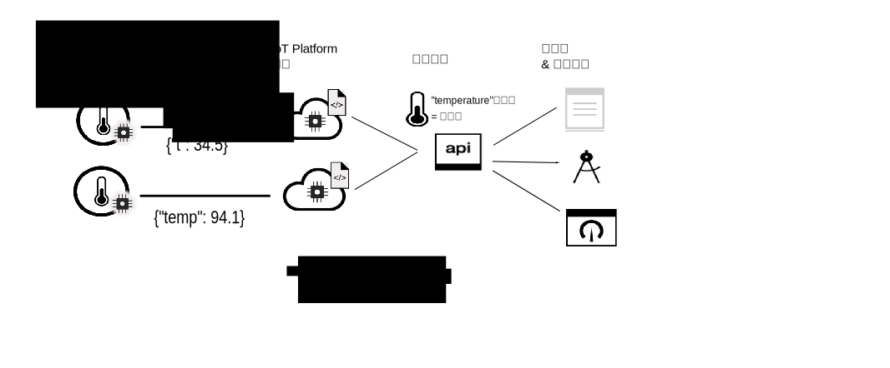

---

copyright:
years: 2017, 2018
lastupdated: "2018-08-28"

---

{:new_window: target="\_blank"}
{:shortdesc: .shortdesc}
{:screen: .screen}
{:codeblock: .codeblock}
{:pre: .pre}

# 資料管理簡介
{: #device_twins}

<!--An unprecedented number of devices and sensors exist in the modern world. Connected devices generate vast amounts of digital data at extraordinary speeds. Such volumes of data represent great opportunities but also challenges, in terms of how big data can be processed, analyzed and presented to help to deliver insights and drive transformation.-->

裝置可能會提供類似的資料輸出，但廠牌、型號及版本不同，而且可以使用不同的格式輸出資料。例如，辦公室中具有溫度感應器的裝置可能會以華氏度數或攝氏度數來報告溫度。配置應用程式無法有效地取用所有這些格式的資料；相反地，需要收集、轉換及正規化資料來建立單一邏輯模型，讓應用程式能夠以相同的方式與不同的裝置互動。 

{{site.data.keyword.iot_short_notm}} 的資料管理元件包括裝置對應項特性及資產對應項特性。裝置對應項特性可讓您將不同格式的裝置資料收集、轉換及正規化為單一邏輯模型。資產對應項特性可讓您將不同的裝置群組在一起來建立「物品」，這是較高值資產型資料結構。您甚至可以將「物品」群組在一起，來建立新的「物品」。不論個別裝置或「物品」使用的資料格式為何，應用程式都可以與邏輯模型互動。 

例如，溫度、濕度及環繞亮度報告裝置的群組可以聚集為 "Room"「物品」，以呈現特定辦公室內的舒適層次。若干 "Room"「物品」可以聚集為 "Floor"「物品」以代表特定樓層的所有辦公室，而若干 "Floor"「物品」都可以聚集為 "Building"「物品」。使用「物品」抽象，以將應用程式與下列特性取消連結：裝置連接方式、裝置用來發佈事件資料的格式以及資料結合方式。
{: shortdesc}

## 裝置對應項

裝置對應項是連接至 {{site.data.keyword.iot_short_notm}} 之實體裝置的一種雲端型數位呈現。裝置對應項代表裝置所發佈事件的邏輯模型。定義及實例化之後，不論裝置是在線上還是離線，裝置對應項都會透過 REST 類似方式來提供與裝置互動的一致方法。使用 HTTP 要求或是訂閱 IoT 主題，即可擷取裝置的內容（包括裝置現行狀態的相關資訊（裝置狀態））。

裝置對應項可協助您：
- 提供一致的介面，讓應用程式開發人員透過 REST 類似方式來存取事件驅動的裝置資料。
- 存取裝置的狀態。
- 正規化不同廠牌或型號之裝置的資料，這些裝置會以不同的格式來發佈資料。
- 過濾出不需要的資料。

若要建立裝置對應項，您需要在 {{site.data.keyword.iot_short_notm}} 中定義下列資源：
- 裝置所傳送事件的結構。  
入埠事件的結構定義於實體介面、事件類型及事件綱目資源中。 
- 您要記錄的內容。  
這些內容定義應用程式可取用之裝置狀態的邏輯結構。這些內容定義於邏輯介面及邏輯綱目資源中。  
- 實體介面事件與邏輯介面內容的對映。  
使用對映資源，以將事件對映至內容。

下圖顯示位於不同位置的兩個不同溫度裝置。其中一個裝置以攝氏度數報告裝置資料，另一個裝置則以華氏度數報告資料。資料會以 "t" 及 "temp" 溫度格式傳送至 {{site.data.keyword.iot_short_notm}}。{{site.data.keyword.iot_short_notm}} 會自動將華氏度數轉換成攝氏度數。"t" 及 "temp" 溫度格式會正規化為 "temperature" 邏輯格式。應用程式可以藉由存取 "temperature" 參數的值來查詢任一裝置的狀態。 

## 資產對應項（物品）

資產對應項可讓您進一步瞭解裝置對應項的概念。資產對應項可讓裝置聚集為稱為「物品」的單一實體。「物品」或資產對應項是與裝置對應項類似的概念，但資產對應項會將一組裝置呈現為單一邏輯模型。您甚至可以聚集「物品」，以構成更高的抽象層次。例如，"Room"「物品」可能會聚集下列裝置：

- 具有溫度感應器的裝置（溫度計）
- 具有濕度感應器的裝置（濕度計）

"Floor"「物品」接著會聚集多個 "Room"「物品」。 

「物品」的結構是使用 JSON-Schema 所定義。此綱目會參照已聚集裝置或「物品」的邏輯介面。使用 HTTP 要求或是訂閱 IoT 主題，即可擷取「物品」的內容（包括「物品」現行狀態的相關資訊）。

資產對應項可協助您：
 
- 聚集多個裝置對應項或「物品」，以定義新的「物品」。
- 存取「物品」的狀態。
- 管理資產，而不會將它們公開至其個別檢測。
- 過濾出不需要的資料。
- 正規化「物品」介面，以將您的應用程式與特定「物品」的建構方式複雜性取消連結。

若要建立資產對應項，您需要在 {{site.data.keyword.iot_short_notm}} 中定義下列資源：

- 「物品」的結構。  
「物品」的結構由指定已聚集裝置或「物品」的「物品」綱目所定義。
- 所需「物品」狀態的結構，可構成您要記錄的內容。  
這些內容定義應用程式可取用之「物品」狀態的邏輯結構。這些內容定義於邏輯介面及邏輯綱目資源中。  
- 「物品」介面如何對映至邏輯介面內容。  
使用對映資源，以將事件對映至內容。

下圖顯示不同裝置上將溫度及濕度事件資料發佈至 {{site.data.keyword.iot_short_notm}} 的溫度及濕度感應器。兩個裝置對應項（各代表一個實體裝置）都有關聯的邏輯介面，並建立於 {{site.data.keyword.iot_short_notm}}。從溫度裝置發佈的資料會對映至 "IThermometer" 邏輯介面。從濕度裝置發佈的資料會對映至 "IHygrometer" 邏輯介面。這些邏輯介面會聚集為具有 "IRoom" 邏輯介面的 *Room*「物品」類型。"IRoom" 邏輯介面定義溫度及濕度內容，並可讓您將裝置聚集為應用程式可與之互動的單一「物品」，來建立您自己的邏輯模型。  

**重要事項：**「{{site.data.keyword.iot_short_notm}} 物品」特性僅是有限測試版程式的一部分。未來更新可能包含與此特性的目前版本不相容的變更。請試用，並且[讓我們知道您的想法 ](https://developer.ibm.com/answers/smart-spaces/17/internet-of-things.html){: new_window}。

如需定義及配置重要資訊和資源的相關資訊，請參閱[瞭解資料管理](ga_im_definitions.html)。 

## 後續步驟

- 在 {{site.data.keyword.iot_short_notm}} 中建立您自己的裝置對應項。如需相關資訊，請參閱[使用 Web 介面開始使用資料管理](im_ui_flow.html)文件。 
- 使用 REST API 來建立裝置對應項及資產對應項。如需相關資訊，請參閱[開始使用資料管理](../information_management/getting_started_things.html)文件。  
- 建立規則，以在 {{site.data.keyword.iot_short_notm}} 接收到符合所指定條件或一組條件的事件資料時觸發。如需相關資訊，請參閱[內嵌規則](../information_management/im_rules.html)測試版文件。

如需*開始使用資料管理* 文件中所概述之每個步驟的其他詳細資訊，請參閱下列各主題所記載的範例情境： 

- [逐步手冊 1：如何透過共用介面使用裝置的詳細範例](ga_im_index_scenario.html#scenario) 
- [逐步手冊 2：如何透過共用介面使用物品的詳細範例](../information_management/im_index_scenario_thing.html#scenario) 

