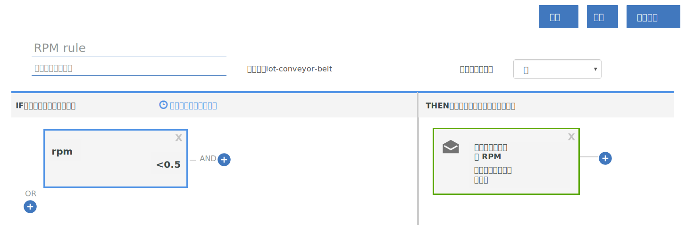

---

copyright:
  years: 2017, 2018
lastupdated: "2018-01-11"

---

{:shortdesc: .shortdesc}
{:new_window: target="_blank"}
{:codeblock: .codeblock}
{:pre: .pre}
{:screen: .screen}
{:tip: .tip}

# 手冊 2：使用基本即時規則及動作

**重要事項：**我們即將發表測試版，以提供在 IoT 裝置資料上定義規則的新方式，作為更廣泛變更計劃的一部分，以改善 {{site.data.keyword.iot_full}} 提供規則和動作的方式。

若要進一步了解，請參閱部落格文章 [An alternative approach to defining Rules on IoT data ](https://developer.ibm.com/iotplatform/2018/03/01/alternative-approach-defining-rules-iot-data/){: new_window}。

若要開始定義您自己的規則，請參閱[建立內嵌規則（測試版）](../information_management/im_rules.html)文件。

## 概觀及目標
{: #overview}  

使用本手冊中的指示來配置一組基本規則及動作，以進行部分輸送帶 IoT 資料的即時分析。


您已順利設定輸送帶，將它連接至 {{site.data.keyword.iot_full}}，並且傳送一些資料，所以現在可以使用規則及動作，讓該資料為您所適用。



在本手冊中，您將：
- 建立輸送帶裝置事件資料的訊息綱目。
- 建立及觸發規則。
- 建立電子郵件動作。

## 必要條件
{: #prereqs}  
您必須具有裝置類型為 `iot-conveyor-belt` 的已連接裝置，以傳送事件名稱為 `sensorData` 且訊息有效負載包括下列內容的事件：
```
{
	"d": {
		"id": "belt1",
		"ts": 1494946276931,
		"ay": "0.00",
		"running": true,
		"rpm": "1.0"
		}
}
```
如需裝置事件及傳訊格式的相關資訊，請參閱[發佈事件](/docs/services/IoT/devices/mqtt.html#publishing_events)。  
如果您已完成[手冊 1：開始使用 {{site.data.keyword.iot_short_notm}} 及模擬輸送帶](getting-started-iot-conveyor.html)，表示已設定所有項目。  
{: tip}

## 步驟 1 - 建立範例應用程式的訊息綱目
{: #create_schema}

若要將裝置所傳送的內容用作規則的觸發程式，您必須先將這些內容對映至 {{site.data.keyword.Bluemix_notm}} 中的傳訊綱目。如需相關資訊，請參閱[建立裝置類型綱目](/docs/services/IoT/im_schemas.html#iotrtinsights_task)。
1. 在 {{site.data.keyword.iot_short_notm}} 儀表板中，移至**裝置**，然後選取**管理綱目**。
2. 按一下**新增綱目**。
3. 選取 **iot-conveyor-belt** 裝置類型，然後按**下一步**。
4. 將內容新增至綱目。
 1. 按一下**新增內容**。
 2. 選取**從已連接的**。
 3. 藉由變更 rpm 值來傳送輸送帶資料點。
在輸送帶 Web 應用程式中，按一下**停止**或**開始**以發佈訊息。  
內容清單中即會移入裝置所傳送的內容。
 4. 選取所有內容，然後按一下**確定**。
5. 按一下**完成**，以建立綱目。  

即會建立綱目，並將 rpm 資料類型設為 Float。

## 步驟 2 - 建立 rpm 內容的簡單規則
{: #create_rule}  
{{site.data.keyword.Bluemix_notm}} 規則引擎會比較您裝置所傳送的內容資料點與規則中所設定的靜態臨界值，並在符合規則條件時觸發規則。如需規則的相關資訊，請參閱[雲端分析](/docs/services/IoT/cloud_analytics.html#rules)。
若要建立輸送帶 rpm 值小於 0.5 時所觸發的規則，請執行下列動作：
1. 將 rpm 內容類型變更為 Float。  
在建立規則時，我們想要比較數值 rpm 值與臨界值。若要這麼做，必須將該內容辨識為浮點或整數。
 1. 在 {{site.data.keyword.iot_short_notm}} 儀表板中，移至**裝置**，然後選取**管理綱目**。
 1. 按一下您剛才建立的新綱目，然後選取**內容**。
 2. 按一下編輯圖示，以編輯綱目。
 3. 按一下 `rpm` 內容旁的編輯圖示。
 4. 將資料類型變更為 `Float`。  
 5. 按一下**確定**。
 6. 按一下**完成**，以更新綱目。  
2. 建立規則。
 1. 在儀表板中，移至**規則**。
 2. 按一下**建立雲端規則**。
 3. 輸入 `RPM rule` 作為名稱。
 4. 設定要套用至 **iot-conveyor-belt** 綱目的規則。
 5. 按**下一步**。
 6. 新增規則條件。
    6. 按一下**新建條件**磚，以新增規則的條件。
    7. 選取 **rpm** 內容。
    8. 選取小於運算子 (`<`)。
    9. 輸入 `0.5` 作為值，然後按一下**確定**。
    10. 按一下**儲存**，然後按一下**關閉**。
 11. 按一下**關閉**。  
新的規則即會列為「已關閉」狀態。
12. 按一下狀態開關，以啟動規則。狀態現在會列為「已啟動」。

## 步驟 3 - 觸發規則
{: #trigger_rule}
降低 rpm，即可模擬可能需要操作員介入的輸送帶問題。符合 rpm 的臨界值時，即會在儀表板中顯示警示。
1. 在 {{site.data.keyword.iot_short_notm}} 儀表板中，選取**板**。
3. 選取**以規則為主的分析**板。
4. 在輸送帶 Web 應用程式中，減少低於 0.5 rpm 的 rpm 值。
感應器讀數變更時，裝置會將資料傳送至 {{site.data.keyword.iot_short_notm}}。您可以停止、啟動或變更輸送帶的速度，來模擬此資料傳送。  
5. 驗證 `RPM rule` 出現在「具有警示的規則」卡中。
6. 在「規則警示」卡中選取新的警示，然後在「規則警示資訊」卡中檢視觸發規則的資料點。  
若要查看警示的相關資訊，請參閱「關聯的裝置」、「裝置資訊」及「裝置內容」卡中的裝置詳細資料。  
{: tip}

## 步驟 4 - 建立在觸發 RPM 規則時要採取的動作
{: #create_action}
除了在 {{site.data.keyword.iot_short_notm}} 儀表板中顯示警示之外，您還可以建立在觸發規則時所採取的動作，例如，將電子郵件傳送給操作員，以在 rpm 太低時查看輸送帶。如需相關資訊，請參閱[雲端分析](/docs/services/IoT/cloud_analytics.html#shared)。
若要建立電子郵件動作，請執行下列動作：
1. 在 {{site.data.keyword.iot_short}} 儀表板中，移至**規則**。
2. 按一下 **RPM rule**。
3. 按一下**新動作**磚。
4. 建立動作。
 1. 按一下**新增動作**。
 2. 輸入動作名稱 `Notify operator about low RPM`。
 3. 輸入說明 `Send an email to the operator.`。
 4. 選取**傳送電子郵件**類型。
 5. 按**下一步**。
 6. 在主旨行中，輸入：`Low RPM alert`。
 7. 在「收件者」欄位中，選取**特定人員**，然後輸入 `operator@company.com`。  
將電子郵件位址替換成您自己的位址。
 8. 選取**包括資料**，以在電子郵件中包括裝置資料。
 9. 按一下**完成**，以儲存動作。  
5. 選取清單中的動作，然後按一下**確定**以設定動作。
6. 按一下**儲存**，以啟用具有規則的動作。
7. 測試新動作。
 4. 在輸送帶 Web 應用程式中，減少低於 0.5 rpm 的 rpm 值。

 5. 驗證您已收到警示電子郵件。  
訊息內文可能與以下範例類似：
> **規則：**RPM rule  
> **裝置：**3m5wxr:iot-conveyor-belt:belt1  
> **日期：**2017-05-09T18:21:21.567Z  
> **條件：**  
> iot_conveyor_belt.d.rpm<0.5  
> **送入訊息：**  
> {"d":{"id":"belt1","ts":1494354089837,"ay":"0.00","rpm":"0.4","running":true},"ruleContent":{"jobID":"sdIyBfdu","contextSchemas":[],"ruleDescription":"","severity":4,"messageSchemas":["iot_conveyor_belt"],"disabled":false,"ruleCondition":"iot_conveyor_belt.d.rpm<0.5","transforms":[],"name":"RPM rule","actions":["pziIRovt"],"id":"ncKK4N7k","updated":"9 May 2017 18:20:25 GMT","created":"9 May 2017 17:41:38 GMT","version":7}}  
> 這是自動產生的電子郵件。請勿回覆。有關此警示的問題，請與系統管理者聯絡。

## 下一步為何？
{: #whats_next}  
繼續進行下一個手冊，或跳至其他感興趣的主題：
- [手冊 3：監視裝置資料](getting-started-iot-monitoring.html)  
您已連接一個以上的裝置，並已開始善用裝置資料，所以現在可以開始監視裝置的集合以及它們所傳送的即時資料。
- [手冊 4：模擬大量裝置](getting-started-iot-large-scale-simulation.html)  
路徑 A 中的輸送帶範例應用程式可讓您手動模擬一或數個輸送帶裝置。本手冊可讓您設定含有大量裝置的模擬環境。
- [將其他 IoT 裝置連接至 {{site.data.keyword.iot_short_notm}}](/docs/services/IoT/iotplatform_task.html)
- [進一步瞭解 {{site.data.keyword.iot_short_notm}}](/docs/services/IoT/iotplatform_overview.html)
- [進一步瞭解 {{site.data.keyword.iot_short_notm}} API](/docs/services/IoT/reference/api.html)
